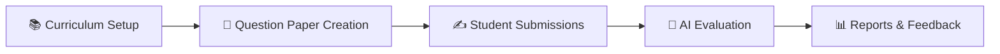
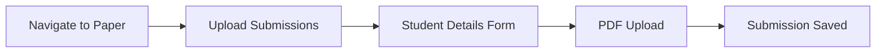
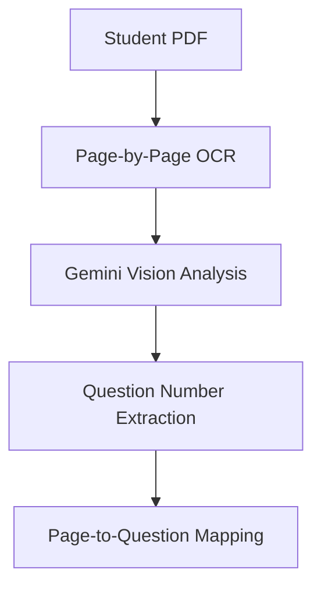
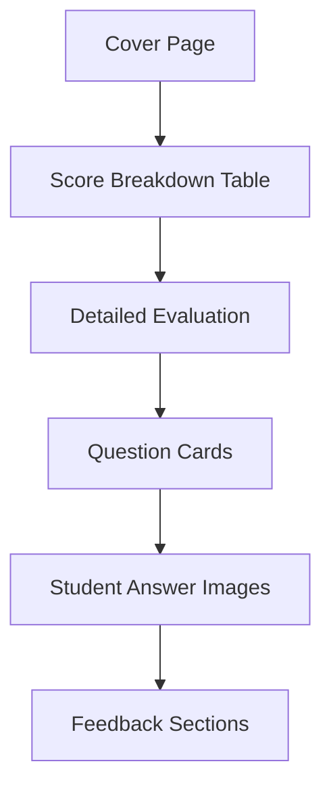
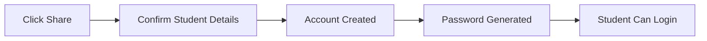

# DASES - Digital Academic Student Evaluation System
## Comprehensive Feature Report & Stakeholder Presentation Guide

---


---

## 📋 Executive Summary

**DASES** is a complete end-to-end digital assessment platform that revolutionizes the academic evaluation process. From question paper creation to AI-powered evaluation and detailed student feedback, DASES automates and enhances every step of the assessment lifecycle.

### Key Metrics
| Metric | Value |
|--------|-------|
| **Sheets Processed** | 400+ |
| **Rubric Accuracy** | 95% |
| **Happy Educators** | 20+ |
| **Support Availability** | 24/7 |

---

## 🆚 Why DASES? Traditional vs. Modern Evaluation

| Feature | ❌ Traditional Evaluation | ✅ DASES AI Evaluation |
|---------|------------------------|---------------------|
| **Turnaround Time** | Days or Weeks | Minutes |
| **Consistency** | Varies by grader/mood | Standardized, rubric-based |
| **Feedback** | Often just marks | Detailed per-question feedback |
| **Scalability** | Linear effort (more students = more work) | Instant scale (10 or 1000 sheets) |
| **Insights** | Hard to aggregate data | Instant class-level analytics |
| **Fairness** | Subjective bias possible | Bias-aware, transparent criteria |

---

## 🔄 Complete Assessment Workflow

The DASES platform follows a comprehensive 4-step workflow that takes educators from paper creation to final evaluation:



---

## 🎯 PHASE 1: Question Paper Creation

### 1.1 Teacher Dashboard
The teacher dashboard is the command center for all assessment activities.

*(Suggestion: Insert Teacher Dashboard Screenshot Here)*

**Features:**
- **Paper Cards** — View all created papers with status, marks, and program details
- **Quick Actions** — Create new papers with one click
- **Paper Status Tracking** — Draft, Final, Active/Inactive indicators
- **Download Options** — PDF (question paper) and Complete Package (with rubrics)

### 1.2 Curriculum Integration
Before creating questions, teachers can link their course curriculum for intelligent coverage analysis.

*(Suggestion: Insert Curriculum Selector Screenshot Here)*

**AI-Powered Curriculum Extraction:**
- Upload PDF/TXT syllabi or paste text directly
- AI automatically extracts units and topics with weights
- Review and edit extracted curriculum before confirmation
- Skip option available for quick paper creation

### 1.3 Question Paper Upload & Extraction
Teachers can upload existing question papers for automatic extraction.

**Extraction Capabilities:**
- **PDF Upload** — Upload scanned or digital question papers
- **OCR Processing** — Extract text using AI vision models
- **LaTeX Support** — Full mathematical notation rendering
- **Question Parsing** — Automatic question number and marks detection

### 1.4 Question Editor (Build & Edit)
A powerful rich-text editor for creating and refining questions.

*(Suggestion: Insert Question Editor Screenshot Here)*

**Key Features:**
| Feature | Description |
|---------|-------------|
| **Rich Text Editing** | Bold, italic, underline, headers, lists |
| **LaTeX Rendering** | Full mathematical notation with live preview |
| **OR Questions** | Link questions as either/or pairs |
| **Question Reordering** | Drag-and-drop or number-based reordering |
| **Image Upload** | Add question diagrams and figures |

### 1.5 Sample Answers & Rubrics
For each question, teachers can define multiple model answer variants and AI-generated rubrics.

**Answer Variant System:**
- **Multiple Variants** — Support for different acceptable answer approaches
- **Model Answers** — Full text with LaTeX support
- **Instructions** — AI guidance for evaluation
- **Answer Images** — Reference diagrams for evaluation

**AI Rubric Generation:**
- Automatic rubric generation from model answers
- Customizable criteria weights
- Per-criterion feedback templates
- Total marks automatically calculated

### 1.6 QuickPass™ Intelligence Analysis
Before finalizing, papers run through an AI-powered quality check.

*(Suggestion: Insert QuickPass Analysis Screenshot Here)*

**Analysis Categories:**
| Check | Purpose |
|-------|---------|
| **Ambiguity Detection** | Flag unclear or confusing questions |
| **Marks-Effort Alignment** | Ensure marks match question difficulty |
| **OR Conflicts** | Validate OR pair consistency |
| **Duplicate Detection** | Identify similar/repeated questions |

**New Feature: Floating Health Status**
A persistent floating widget that tracks "Paper Health" in real-time.
- **Health Score (0-100)** — A single metric indicating paper quality.
- **Live Issue Counter** — instant feedback on validation metrics.
- **One-Click Re-analyze** — Update checks instantly after editing questions.

### 1.7 Syllabus Coverage Widget
Ensure your question paper tests the entire curriculum effectively.

*(Suggestion: Insert Coverage Widget Screenshot Here)*

**Coverage Metrics:**
- **Overall Coverage %** — Visual circular progress indicator.
- **Unit Breakdown** — Color-coded bars showing coverage per unit.
- **Uncovered Topics Warning** — List of topics missed in the current paper draft.
- **Topic Mapping** — Intelligent linking of questions to syllabus topics.

### 1.8 Review & Finalize
The final review step before publishing the paper.

**Review Dashboard Features:**
- Paper statistics (Total Questions, Total Marks, Completion %)
- Expand/collapse all questions
- QuickPass issues displayed per question
- Answer variant inspection with rubric details
- One-click finalization

---

## 📥 PHASE 2: Submission Management

### 2.1 Uploading Answer Sheets (Teacher Portal)
Teachers can manage student submissions through a dedicated interface.

**Submission Workflow:**


### 2.2 Student Self-Upload
Students can also upload their own answer sheets through the student portal.

**Student Portal Features:**
- View assigned papers
- Check paper status (Active/Inactive)
- Upload answer sheet PDFs
- Track submission status

---

## 🤖 PHASE 3: AI-Powered Evaluation

### 3.1 Evaluation Dashboard
The central hub for managing all evaluations.

**Dashboard Features:**
- **Paper-wise Grouping** — Submissions organized by paper
- **Status Tracking** — Pending, Pages Detected, Evaluated
- **Bulk Actions** — Process multiple submissions
- **Live Sync** — Auto-refresh every 30 seconds

### 3.2 Question Detection (OCR)
Before evaluation, the system detects which questions each student attempted.

**Detection Process:**


### 3.3 Full Evaluation
The core AI evaluation engine processes each submission.

**Evaluation Features:**
- **Rubric-Based Scoring** — Each criterion evaluated separately
- **Per-Question Feedback** — Detailed comments for every answer
- **Suggested Scores** — AI-calculated marks with justification
- **OR Question Handling** — Only evaluated if attempted
- **Image Analysis** — Direct evaluation from handwritten answers

**Evaluation Output:**
```json
{
  "results": [
    {
      "qid": "q1",
      "qNumber": 1,
      "marks": 10,
      "evaluation": {
        "suggestedScore": 8,
        "feedback": "Well-structured answer with clear explanation...",
        "criteria": [
          {
            "criterion": "Concept Understanding",
            "max_marks": 4,
            "obtained_marks": 4,
            "feedback": "Excellent grasp of core concepts..."
          }
        ]
      }
    }
  ]
}
```

---

## 📊 PHASE 4: Reports & Results

### 4.1 Teacher Reports Dashboard
Comprehensive view of all evaluation results grouped by paper.

**Report Features:**
| Feature | Description |
|---------|-------------|
| **Paper Grouping** | Reports organized by exam/paper |
| **Score Display** | Score/Total for each student |
| **Status Badges** | Completed, Pending, In Progress |
| **Submission Dates** | Track when papers were submitted |

**Available Actions:**
- **View Report** — Detailed web-based report
- **Download PDF** — Professional PDF report
- **Share Results** — Create student login for result access

### 4.2 Detailed Evaluation Report (Web View)
Interactive report page with complete evaluation details.

*(Suggestion: Insert Report Screenshot Here)*

**Report Sections:**

1. **Student Information Card**
   - Name, Enrollment No, Email
   - Paper name, Submission date

2. **Summary Cards**
   - Total Questions
   - Maximum Marks
   - Total Score (highlighted)
   - Percentage

3. **Question-by-Question Breakdown**
   - Question text with LaTeX
   - Score per question
   - Evaluation criteria breakdown
   - Per-criterion marks and feedback
   - Overall question feedback
   - Student answer images (clickable lightbox)

4. **OR Question Handling**
   - Visual OR grouping
   - Attempted vs Not Attempted status
   - Only attempted question evaluated

### 4.3 PDF Report Generation
Professional, branded PDF reports for distribution.

**PDF Report Structure:**



**Cover Page Elements:**
- DASES Logo and branding
- Student name and enrollment
- Paper details
- Final score with percentage ring
- Submission and evaluation dates

**Score Breakdown:**
- Centered table with columns: Question, Max, Obtained, Percentage
- Color-coded performance indicators
- OR question pairs grouped
- Total row with summary

**Question Details:**
- Question text with header
- Score badge (color-coded)
- Student answer images (compressed, aspect-ratio preserved)
- Evaluation criteria cards with marks and feedback
- Overall feedback section

### 4.4 Sharing Results with Students
Teachers can create student accounts to share results.

**Share Flow:**


---

## 👨‍🎓 Student Portal

### 5.1 Student Dashboard
A dedicated portal for students to access their results.

*(Suggestion: Insert Student Dashboard Screenshot Here)*

**Dashboard Features:**
- **Profile Management** — Edit name, course, year, phone
- **Assigned Papers** — View all papers assigned to them
- **Submission Status** — Track what's been submitted
- **My Reports** — Access evaluated results

### 5.2 Reports Access
Students can view their detailed reports and provide feedback.

**Available Actions:**
- **View Report** — Full web-based evaluation report
- **Give Feedback** — Rate and comment on evaluation
- **Track Progress** — See all submissions and scores

### 5.3 Feedback System
Students can provide feedback on their evaluations.

**Feedback Form:**
- Text feedback area
- Star rating (1-5)
- Linked to specific submission
- Stored for quality improvement

---

## 🔒 Security & Data Privacy

DASES is built with enterprise-grade security to protect sensitive student data.

| Security Layer | Description |
|----------------|-------------|
| **Data Storage** | All data stored in **Supabase** with Row-Level Security (RLS) enforcement. |
| **Authentication** | Secure, session-based authentication for both teachers and students. |
| **Privacy Access** | Students can only access their *own* data. Teachers see only their *own* papers. |
| **Encryption** | Data encrypted at rest and in transit. |
| **Audit Trails** | Complete tracking of submission times and evaluation modifications. |

---

## 🗣️ User Testimonials

> "DASES dramatically improved our evaluation turnaround time while maintaining academic rigor. Our faculty can now focus more on teaching and mentorship."  
> — **Dr. Sanjeev Kumar, Professor**

> "We saw immediate impact. Faster grading, consistent rubrics, and detailed student feedback — DASES has set a new benchmark."  
> — **Dr. Lalit Sachan, Director AI/ML**

> "The transparency and quality of feedback helped students learn better. A true innovation in descriptive assessment."  
> — **Dr. Virender Kadyan, HOD Data Science**

---

## 🔮 Future Roadmap

DASES is constantly evolving. Here is a glimpse into what's coming next:

- **📱 Mobile App** — Native mobile app for students to scan and upload answer sheets directly.
- **📈 Advanced Analytics** — Longitudinal tracking of student performance against course outcomes (POs/COs).
- **🔗 LMS Integration** — Seamless plugin for Canvas, Moodle, and Blackboard.
- **🤖 Copilot for Reviewers** — AI assistant to help human reviewers intervene/adjust marks faster.
- **🌍 Multiple Language Support** — Evaluating papers in Hindi, French, and Spanish.

---

## 🚀 Demo Walkthrough Suggestions

### For Stakeholder Presentation

1. **Landing Page Tour** (2 min)
   - Show Hero section with value props
   - Highlight **Testimonials** and Key Metrics
   - Demonstrate the "Book Demo" form

2. **Paper Creation Flow** (5 min)
   - Create new paper from dashboard
   - Upload/paste curriculum
   - Add questions with **LaTeX** equations
   - Set up **OR questions** and **Answer Variants**
   - Click "Generate Rubric" to show AI magic

3. **QuickPass Demo** (2 min)
   - Run analysis on a draft paper
   - Show how it detects **Ambiguity** or **Difficulty Mismatch**
   - Review suggestions

4. **Evaluation Demo** (3 min)
   - Upload a sample handwritten submission PDF
   - Run **Question Detection** (OCR)
   - Trigger **Evaluate** and watch results appear live

5. **Report Showcase** (3 min)
   - View detailed web report (show images, criteria cards)
   - Download the **Professional PDF Report**
   - Show student portal access and feedback loop

---

## 📞 Contact & Support

**DASES** provides 24/7 support for all institutional users.

- **Technical Support** — Available via dashboard
- **Demo Booking** — Contact form on landing page
- **Documentation** — Comprehensive user guides

---

> *"DASES empowers educators and delivers results institutions can rely on."*

---

**Prepared for Stakeholder Presentation**  
**Date:** January 15, 2026  
**Version:** 1.0

