# DASES Complete User Journey
## Step-by-Step Workflow with Features & Details

---

## 🎯 Overview

This document provides a **complete user journey** through the DASES platform, detailing every screen, action, and feature a user encounters from start to finish.

```mermaid
flowchart TB
    subgraph TEACHER["👨‍🏫 TEACHER JOURNEY"]
        T1[Login] --> T2[Dashboard]
        T2 --> T3[Create Paper]
        T3 --> T4[Link Curriculum]
        T4 --> T5[Upload/Extract Questions]
        T5 --> T6[Build & Edit Questions]
        T6 --> T7[Add Sample Answers]
        T7 --> T8[Generate Rubrics]
        T8 --> T9[QuickPass Analysis]
        T9 --> T10[Review & Finalize]
        T10 --> T11[Manage Submissions]
        T11 --> T12[Run Evaluation]
        T12 --> T13[View Reports]
        T13 --> T14[Share Results]
    end
    
    subgraph STUDENT["👨‍🎓 STUDENT JOURNEY"]
        S1[Login] --> S2[Dashboard]
        S2 --> S3[View Assigned Papers]
        S3 --> S4[Upload Answer Sheet]
        S4 --> S5[Wait for Evaluation]
        S5 --> S6[View Report]
        S6 --> S7[Give Feedback]
    end
```



---

# 👨‍🏫 TEACHER JOURNEY

---

## Step 1: Login & Authentication

| Element | Details |
|---------|---------|
| **URL** | `/SignIn` |
| **Auth Provider** | Supabase Authentication |
| **Roles** | Teacher, Student, Admin |

**What Happens:**
1. Teacher enters email and password
2. Supabase validates credentials
3. Role-based redirect to appropriate dashboard

---

## Step 2: Teacher Dashboard

| Element | Details |
|---------|---------|
| **URL** | `/teacher/dashboard` |
| **Purpose** | Central command center for all activities |

**Screen Elements:**

```
┌─────────────────────────────────────────────────────────────┐
│  SIDEBAR                    │  MAIN CONTENT                 │
│  ─────────                  │  ───────────                  │
│  📊 Dashboard               │  ┌─────────────────────────┐  │
│  📝 Evaluations             │  │  QUICK ACTIONS          │  │
│  📄 Reports                 │  │  [+ Upload New Paper]   │  │
│  📋 Answer Sheets           │  └─────────────────────────┘  │
│  ⚙️ Settings                │                               │
│                             │  YOUR QUESTION PAPERS         │
│                             │  ┌─────────────────────────┐  │
│                             │  │ Subject: Mathematics    │  │
│                             │  │ Exam: Midterm May 2026  │  │
│                             │  │ Status: Draft ⚠️        │  │
│                             │  │ [Continue] [Download]   │  │
│                             │  └─────────────────────────┘  │
└─────────────────────────────────────────────────────────────┘
```

**Available Actions:**
- ➕ **Upload New Paper** → Opens paper creation modal
- ▶️ **Continue** → Resume editing draft paper
- 📄 **Download PDF** → Get question paper only
- 📋 **Download Complete** → Get paper + answers + rubrics
- ⬆️ **Upload Submissions** → Add student answer sheets

---

## Step 3: Create New Paper

| Element | Details |
|---------|---------|
| **Trigger** | Click "+ Upload New Paper" button |
| **Type** | Modal dialog |

**Form Fields:**

| Field | Required | Example |
|-------|----------|---------|
| Subject Name | ✅ | "Data Structures" |
| Subject Code | ✅ | "CS301" |
| Year | ✅ | 2026 |
| Faculty Name | ✅ | "Dr. Sharma" |
| Exam Type | ✅ | "Midterm" or "Final" |
| Exam Month-Year | ✅ | "May 2026" |
| Program | ✅ | "B.Tech CSE" |
| Semester | ✅ | 4 |
| Course | ✅ | "Computer Science" |
| Time Allowed | ❌ | "3 Hours" |
| Max Marks | ❌ | 100 |
| Instructions | ❌ | "Answer all questions..." |

**On Submit:**
- Paper record created in database
- Status set to "draft"
- Redirects to Paper Editor page

---

## Step 4: Link Curriculum (Optional)

| Element | Details |
|---------|---------|
| **URL** | `/teacher/papers/[id]` (Step 0) |
| **Purpose** | Enable syllabus coverage analysis |

**Options Available:**

1. **Select Existing Curriculum**
   - Browse previously uploaded syllabi
   - One-click to link

2. **Upload New Curriculum**
   - Upload PDF/TXT file
   - OR paste text directly
   - AI extracts units and topics automatically

3. **Skip**
   - Proceed without curriculum
   - Coverage analysis unavailable

**AI Extraction Process:**
```
Upload PDF → Gemini Vision OCR → Extract Units → Extract Topics → Assign Weights → Review & Edit → Confirm
```

**Editable Elements:**
- Unit names
- Topic names
- Topic weights (importance scores)
- Add/delete units and topics

---

## Step 5: Upload & Extract Questions

| Element | Details |
|---------|---------|
| **URL** | `/teacher/papers/[id]` (Step 1) |
| **Component** | `UploadAndExtract.js` |

**Upload Options:**

| Method | Description |
|--------|-------------|
| **PDF Upload** | Upload scanned/digital question paper |
| **Manual Entry** | Add questions one by one |

**Extraction Process:**
```
PDF Upload → Convert to Images → Gemini Vision OCR → Parse Question Numbers → Extract Text → Detect Marks → Create Question Objects
```

**Extracted Data Per Question:**
- Question number
- Question text (with LaTeX)
- Marks allocated
- Associated images

---

## Step 6: Build & Edit Questions

| Element | Details |
|---------|---------|
| **URL** | `/teacher/papers/[id]` (Step 2) |
| **Component** | `QuestionEditor.js` |

**Question Card Elements:**

```
┌────────────────────────────────────────────────────────────────┐
│  Question 1                                    [📤 Move] [🗑️]  │
├────────────────────────────────────────────────────────────────┤
│  ┌──────────────────────────────────────────────────────────┐  │
│  │ Question Text (Rich Text Editor)                         │  │
│  │ Supports: Bold, Italic, LaTeX ($e=mc^2$), Lists, Images  │  │
│  └──────────────────────────────────────────────────────────┘  │
│                                                                │
│  Marks: [10]        OR Question: [Toggle ⚡]                   │
│                                                                │
│  📎 Attached Images: [image1.png] [+ Add Image]               │
└────────────────────────────────────────────────────────────────┘
```

**Rich Text Features:**
- **Bold/Italic/Underline** — Standard formatting
- **LaTeX Rendering** — `$\frac{a}{b}$` renders as fraction
- **Image Upload** — Diagrams and figures
- **Question Reordering** — Number-based position change

**OR Question Feature:**
- Toggle to mark as "OR" question
- System pairs with next question
- Students answer only ONE from the pair
- Evaluation handles this automatically

---

## Step 7: Add Sample Answers (Variants)

| Element | Details |
|---------|---------|
| **Location** | Inside each Question Card |
| **Purpose** | Provide model answers for AI evaluation |

**Variant Structure:**

```
┌─────────────────────────────────────────────────────────────┐
│  VARIANT 1                                         [🗑️]     │
├─────────────────────────────────────────────────────────────┤
│  AI Instructions:                                           │
│  ┌───────────────────────────────────────────────────────┐  │
│  │ "Accept any valid sorting algorithm with correct      │  │
│  │  time complexity analysis..."                         │  │
│  └───────────────────────────────────────────────────────┘  │
│                                                             │
│  Model Answer:                                              │
│  ┌───────────────────────────────────────────────────────┐  │
│  │ "Bubble sort has O(n²) time complexity because..."    │  │
│  └───────────────────────────────────────────────────────┘  │
│                                                             │
│  Answer Images: [diagram.png] [+ Upload]                    │
│                                                             │
│  [🤖 Generate Rubric]                                       │
└─────────────────────────────────────────────────────────────┘
```

**Multiple Variants:**
- Support for different correct approaches
- Each variant can have its own rubric
- AI considers all variants during evaluation

---

## Step 8: Generate Rubrics

| Element | Details |
|---------|---------|
| **Trigger** | Click "Generate Rubric" on a variant |
| **API** | `/api/papers/[id]/questions/[qid]/rubric` |

**Input to AI:**
- Question text
- Model answer
- Maximum marks
- Answer images (if any)

**Generated Rubric Structure:**

| Criterion | Weight | Description |
|-----------|--------|-------------|
| Concept Understanding | 4 | Demonstrates knowledge of core concepts |
| Correct Approach | 3 | Uses valid method to solve problem |
| Mathematical Accuracy | 2 | All calculations are correct |
| Presentation | 1 | Well-organized and clear explanation |

**Rubric Editor:**
- Edit criterion names
- Adjust weights
- Add/remove criteria
- Weights must sum to question marks

---

## Step 9: QuickPass™ Analysis

| Element | Details |
|---------|---------|
| **Trigger** | Click "⚡ Analyze with QuickPass" |
| **API** | `/api/papers/[id]/quickpass/analyze` |

**Analysis Checks:**

```
┌────────────────────────────────────────────────────────────┐
│  ⚡ QUICKPASS ANALYSIS RESULTS                             │
├────────────────────────────────────────────────────────────┤
│  Paper Health: ████████████░░░░ 78/100                     │
├────────────────────────────────────────────────────────────┤
│  ✅ Ambiguity Check        — 0 issues                      │
│  ⚠️ OR Conflicts           — 1 issue                       │
│  ✅ Marks-Effort Alignment — 0 issues                      │
│  ✅ Duplicate Detection    — 0 issues                      │
├────────────────────────────────────────────────────────────┤
│  ISSUES FOUND:                                             │
│  ┌──────────────────────────────────────────────────────┐  │
│  │ ⚠️ HIGH: Q3 vs Q4 (OR pair)                          │  │
│  │ Issue: Q3 is significantly easier than Q4            │  │
│  │ 💡 Suggestion: Add sub-parts to Q3 or simplify Q4    │  │
│  └──────────────────────────────────────────────────────┘  │
└────────────────────────────────────────────────────────────┘
```

**Floating QuickPass Widget:**
- Persistent button in corner of screen
- Shows issue count badge
- Expands to show health score
- Quick re-analyze and approve actions

---

## Step 10: Syllabus Coverage Analysis

| Element | Details |
|---------|---------|
| **Component** | `CoverageWidget.js` |
| **Requires** | Linked curriculum |

**Coverage Display:**

```
┌────────────────────────────────────────────────────────────┐
│  📊 SYLLABUS COVERAGE                          [🔄 Refresh] │
├────────────────────────────────────────────────────────────┤
│                                                            │
│         ┌───────┐                                          │
│        /  72%   \   Overall Coverage                       │
│       │  ████   │   18/25 topics covered                   │
│        \       /                                           │
│         └───────┘                                          │
│                                                            │
│  Unit 1: Arrays        ████████████████░░░░  80%           │
│  Unit 2: Linked Lists  ████████████░░░░░░░░  60%           │
│  Unit 3: Trees         ████████████████████  100%          │
│  Unit 4: Graphs        ████████░░░░░░░░░░░░  40%           │
│                                                            │
│  ⚠️ 7 Uncovered Topics:                                    │
│  • AVL Tree Rotations                                      │
│  • Graph Coloring                                          │
│  • Dijkstra's Algorithm                                    │
│  • ...and 4 more                                           │
└────────────────────────────────────────────────────────────┘
```

---

## Step 11: Review & Finalize

| Element | Details |
|---------|---------|
| **URL** | `/teacher/papers/[id]/review` |
| **Purpose** | Final check before publishing |

**Review Dashboard:**

```
┌─────────────────────────────────────────────────────────────┐
│  SIDEBAR              │  MAIN CONTENT                       │
│  ────────             │  ───────────                        │
│  DASES                │  📑 Paper Review                    │
│  PAPER STUDIO         │  Mathematics (MATH301)              │
│                       │                                     │
│  Steps:               │  [✏️ Edit] [📄 PDF] [📋 Full] [✅]  │
│  ✅ 0. Curriculum     │                                     │
│  ✅ 1. Upload         │  ┌─────────────────────────────────┐│
│  ✅ 2. Build          │  │ 10 Questions │ 100 Marks │ Draft││
│  🔵 3. Review         │  └─────────────────────────────────┘│
│                       │                                     │
│  Readiness: 80%       │  QUESTIONS:                         │
│  ████████░░           │  ▶ Q1 [10 marks] ✓ 2 variants       │
│  8/10 ready           │  ▶ Q2 [10 marks] ✓ 1 variant        │
│                       │  ▼ Q3 [15 marks] ⚠️ 1 issue         │
│                       │    [Expanded question content...]   │
└─────────────────────────────────────────────────────────────┘
```

**Actions:**
- **Edit** → Go back to editor
- **PDF** → Download question paper
- **Full Package** → Download with answers and rubrics
- **Finalize** → Lock paper for submissions

**Finalization:**
- Paper status changes to "final"
- No further edits allowed
- Enables submission uploads

---

## Step 12: Manage Submissions

| Element | Details |
|---------|---------|
| **URL** | `/teacher/papers/[id]/submissions` |
| **Purpose** | Upload student answer sheets |

**Submission Form:**

| Field | Required | Description |
|-------|----------|-------------|
| Student Name | ✅ | Full name of student |
| Enrollment No | ✅ | Unique student ID |
| Email | ✅ | For result sharing |
| Answer Sheet PDF | ✅ | Scanned answer booklet |

**Bulk Upload:**
- Upload multiple PDFs at once
- System extracts student info if available
- Manual verification before save

---

## Step 13: Run Evaluation

| Element | Details |
|---------|---------|
| **URL** | `/teacher/evaluations` |
| **Purpose** | Process submissions with AI |

**Evaluation Dashboard:**

```
┌────────────────────────────────────────────────────────────┐
│  DASES EVALUATION DASHBOARD                                │
├────────────────────────────────────────────────────────────┤
│  📄 Mathematics (Midterm May 2026)                         │
│  B.Tech CSE | Sem 4                    [▼ View Submissions]│
├────────────────────────────────────────────────────────────┤
│  Student      │ Enrollment │ Status      │ Score │ Actions │
│  ─────────────│────────────│─────────────│───────│─────────│
│  John Doe     │ 2024001    │ ✅ Evaluated │ 78/100│ [View]  │
│  Jane Smith   │ 2024002    │ 🔍 Detected  │   -   │ [Eval]  │
│  Bob Wilson   │ 2024003    │ ⏳ Pending   │   -   │ [Detect]│
└────────────────────────────────────────────────────────────┘
```

**Two-Step Process:**

1. **Detect Questions** (OCR)
   - Gemini Vision analyzes each page
   - Identifies question numbers written by student
   - Maps pages to questions

2. **Evaluate**
   - AI compares student answers to rubrics
   - Generates per-criterion scores
   - Produces detailed feedback
   - Calculates total score

---

## Step 14: View & Share Reports

| Element | Details |
|---------|---------|
| **URL** | `/teacher/reports` |
| **Purpose** | Access all evaluation results |

**Reports Table:**

```
┌────────────────────────────────────────────────────────────────┐
│  📚 EVALUATION REPORTS BY TEST                                 │
├────────────────────────────────────────────────────────────────┤
│  Mathematics (Midterm - May 2026)                              │
│  B.Tech CSE | Semester 4                                       │
├────────────────────────────────────────────────────────────────┤
│  Student   │ Enrollment │ Status    │ Score  │ Actions         │
│  ──────────│────────────│───────────│────────│─────────────────│
│  John Doe  │ 2024001    │ Completed │ 78/100 │ [View][PDF][📤] │
│  Jane Smith│ 2024002    │ Completed │ 85/100 │ [View][PDF][📤] │
└────────────────────────────────────────────────────────────────┘
```

**Actions:**
- **View** → Open detailed web report
- **PDF** → Download professional PDF report
- **Share (📤)** → Create student account for access

---

# 👨‍🎓 STUDENT JOURNEY

---

## Step 1: Student Login

| Element | Details |
|---------|---------|
| **URL** | `/SignIn` |
| **Credentials** | Created by teacher via "Share Results" |

---

## Step 2: Student Dashboard

| Element | Details |
|---------|---------|
| **URL** | `/student/dashboard` |

**Dashboard Layout:**

```
┌─────────────────────────────────────────────────────────────┐
│  SIDEBAR              │  MAIN CONTENT                       │
│  ────────             │  ───────────                        │
│  DASES Student        │  Hi John 👋                         │
│                       │  You have 2 assigned papers.        │
│  Profile:             │                                     │
│  John Doe             │  ASSIGNED PAPERS:                   │
│  john@email.com       │  ┌─────────────────────────────────┐│
│  B.Tech CSE           │  │ Mathematics                     ││
│  Year 2               │  │ Midterm - May 2026              ││
│  📞 9876543210        │  │ Active: ✅ Yes                  ││
│  [✏️ Edit Profile]    │  │ [⬆️ Upload Answer Sheet]        ││
│                       │  └─────────────────────────────────┘│
│  Navigation:          │                                     │
│  📊 Dashboard         │  MY REPORTS:                        │
│  📄 My Reports        │  ┌─────────────────────────────────┐│
│                       │  │ Physics - Score: 72/100         ││
│                       │  │ [📄 View Report] [💬 Feedback]  ││
│                       │  └─────────────────────────────────┘│
└─────────────────────────────────────────────────────────────┘
```

---

## Step 3: Upload Answer Sheet

| Element | Details |
|---------|---------|
| **URL** | `/student/upload/[submissionId]` |
| **Condition** | Paper must be "Active" |

**Upload Form:**
- Select PDF file (scanned answer booklet)
- Preview before submit
- Confirmation on success

---

## Step 4: View Evaluation Report

| Element | Details |
|---------|---------|
| **URL** | `/reports/[submissionId]` |

**Report Sections:**

```
┌────────────────────────────────────────────────────────────┐
│  EVALUATION REPORT                     [📥 Download PDF]   │
├────────────────────────────────────────────────────────────┤
│  STUDENT INFORMATION                                       │
│  Name: John Doe  │  Enrollment: 2024001  │  Paper: Math   │
├────────────────────────────────────────────────────────────┤
│  SUMMARY                                                   │
│  ┌──────────┐ ┌──────────┐ ┌──────────┐ ┌──────────┐      │
│  │ 10       │ │ 100      │ │ 78       │ │ 78%      │      │
│  │ Questions│ │ Max Marks│ │ Score    │ │ Percentage│     │
│  └──────────┘ └──────────┘ └──────────┘ └──────────┘      │
├────────────────────────────────────────────────────────────┤
│  DETAILED EVALUATION                                       │
│  ┌──────────────────────────────────────────────────────┐  │
│  │ Question 1                              Score: 8/10  │  │
│  │ ────────────────────────────────────────────────────  │  │
│  │ Q: Explain bubble sort with time complexity.         │  │
│  │                                                      │  │
│  │ EVALUATION BREAKDOWN:                                │  │
│  │ ┌──────────────────────────────────────────────────┐ │  │
│  │ │ Concept Understanding          4/4               │ │  │
│  │ │ ✓ Excellent grasp of sorting fundamentals       │ │  │
│  │ ├──────────────────────────────────────────────────┤ │  │
│  │ │ Algorithm Steps                3/4               │ │  │
│  │ │ ⚠ Missing swap condition explanation           │ │  │
│  │ ├──────────────────────────────────────────────────┤ │  │
│  │ │ Time Complexity                1/2               │ │  │
│  │ │ ✗ Incorrect best-case analysis                  │ │  │
│  │ └──────────────────────────────────────────────────┘ │  │
│  │                                                      │  │
│  │ OVERALL FEEDBACK:                                    │  │
│  │ Good understanding of basic concepts. Review best-   │  │
│  │ case scenarios for comparison-based sorting.         │  │
│  │                                                      │  │
│  │ YOUR ANSWER SHEET: [🔍 Page 1] [🔍 Page 2]          │  │
│  └──────────────────────────────────────────────────────┘  │
└────────────────────────────────────────────────────────────┘
```

---

## Step 5: Give Feedback

| Element | Details |
|---------|---------|
| **Trigger** | Click "💬 Give Feedback" |
| **Type** | Modal dialog |

**Feedback Form:**
- Text area for comments
- Star rating (1-5)
- Linked to specific submission
- Stored for quality improvement

---

# 📊 Summary: Complete Feature Map

| Phase | Features |
|-------|----------|
| **Setup** | Authentication, Role-based Access, Dashboard |
| **Paper Creation** | Curriculum Linking, PDF Extraction, OCR, LaTeX Editor, OR Questions |
| **Quality Control** | AI Rubric Generation, QuickPass Analysis, Coverage Widget, Paper Health Score |
| **Submission** | Bulk Upload, Student Self-Upload, PDF Storage |
| **Evaluation** | Question Detection (OCR), Rubric-Based Scoring, Handwriting Analysis |
| **Reporting** | Web Reports, PDF Generation, Student Portal, Feedback Loop |

---

**This completes the full user journey through DASES!**

Use this document alongside the main feature report for a comprehensive stakeholder presentation.
