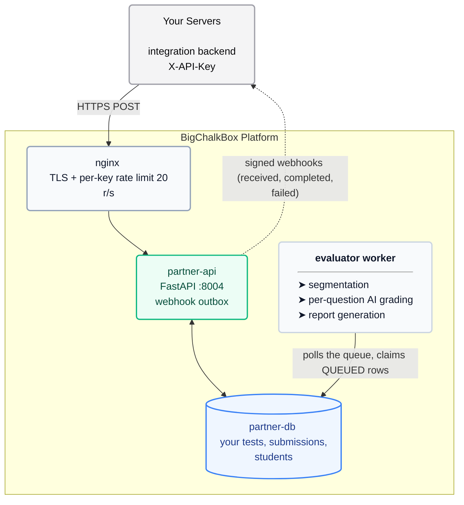
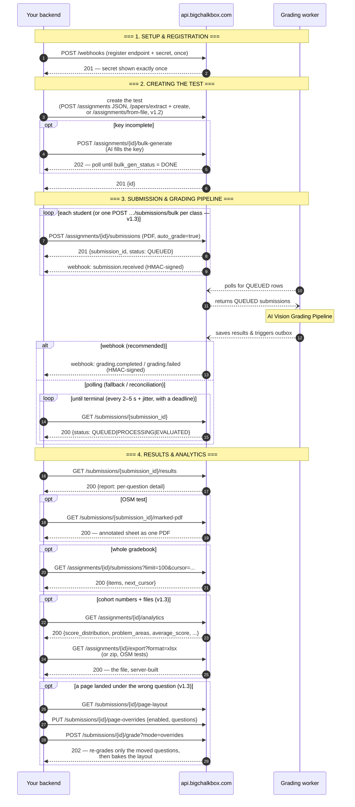

# BigChalkBox Partner API — Integration Guide

For the engineers building against the API. The [Reference](partner-api-reference.md) is
the **contract** (exact routes, payloads, errors) — this guide is the **how and why**:
how the platform works behind the endpoint, how to integrate it well, and what to check
before you go live.

> **Synced to Partner API v1.3 (2026-09-23):** the **ops surface** — a test
> cycle now runs end-to-end server-side: batch upload
> (`POST /assignments/{id}/submissions/bulk`, 1–50 PDFs with a per-file
> report), cohort analytics (`GET /assignments/{id}/analytics`), server-built
> exports (`GET /assignments/{id}/export?format=xlsx|zip`), fast re-grade
> modes (`POST /submissions/{id}/grade?mode=existing-pages|overrides`) and
> page rearrangement (`…/page-layout`, `…/page-overrides`).
>
> **v1.2 (2026-09-23):** the **content door** — tests can be created without
> hand-built JSON: `POST /papers/extract` (paper PDF → questions),
> `POST /assignments/from-file` (Markdown template), and
> `POST /assignments/{id}/bulk-generate` (AI fills the missing answer key).
> Webhooks remain the primary completion path, and results come back as files
> too (v1.1).

Also available: [`partner-api-openapi.json`](partner-api-openapi.json) — a machine-readable
spec generated from the deployed service. Import it into Postman or Insomnia to explore
every endpoint interactively (§9).

---

## 1. How the platform works



Key facts that shape everything else:

- **Grading is asynchronous and queue-driven.** "Trigger grading" just marks a row
  `QUEUED`; a worker claims it within seconds.
- **Completion is push-first (v1.1).** Register one webhook endpoint (§3, step 2)
  and the platform POSTs you `grading.completed` / `grading.failed` as runs
  finish — HMAC-signed, retried for ~2.5 h, and inspectable in the delivery log.
  Polling `GET /submissions/{id}` remains fully supported as a fallback and for
  reconciliation, but it is no longer the primary path.
- **Results come back as files too (v1.1, cohort-level in v1.3).** Beyond the
  JSON report: the original sheet (`GET …/pdf`, 302 → presigned URL), the
  per-question page images (`GET …/pages`), and — for OSM tests — the marked
  answer sheet (`GET …/marked-pdf`, one annotated PDF). In v1.3 the platform
  builds the cohort files for you: `GET /assignments/{id}/export?format=xlsx`
  (the full results roster) and `?format=zip` (all marked PDFs in one archive) —
  no client-side file assembly.
- **A test cycle runs entirely server-side (v1.3 — the ops surface).** Upload
  a whole scanned class in one batch (`POST …/submissions/bulk` — explicit
  per-file student map or `[ID]_[First]_[Last].pdf` + your email domain), read
  the cohort numbers (`GET …/analytics`: score bands, problem areas, counts),
  and re-grade without re-running the pipeline
  (`grade?mode=existing-pages`, or rearrange pages first and
  `grade?mode=overrides`).
- **Tests can be created without hand-built JSON (v1.2 — the content door).**
  Three paths (Reference §4.6): extract questions from your paper PDF
  (`POST /papers/extract`), create a test from a Markdown template
  (`POST /assignments/from-file`), and let the platform's AI fill any missing
  model answers / rubrics / MCQ answers (`POST /assignments/{id}/bulk-generate`,
  202 + poll). Key-less tests are legal — the grading gate simply refuses to
  queue an uncovered question, so nothing grades silently. Which AI reads your
  papers and grades your tests is managed by BigChalkBox server-side; no
  request exposes an engine or provider parameter.
- **Two databases, strictly separated.** Your tests/submissions/students live in a
  dedicated partner database. The only cross-touchpoints are key authentication and
  the `GET /usage` metering read. Nothing you do can affect the consumer product's data.
- **Your key is your tenancy.** Everything your key creates belongs to your service
  account (`api-client-<your-name>@api.internal`). Other keys' objects answer `404`
  to you — existence is never leaked across tenants.
- **Grading itself is AI vision.** The worker renders each PDF page to an image,
  segments answers per question, and grades each question against your rubric
  (SUBJECTIVE) or `correct_answers` (MCQ). Rubric quality directly drives grade
  quality — write rubrics like you'd brief a human examiner. Tests created with
  `osm_enabled: true` additionally get the student's own pages annotated
  (ticks/crosses + examiner remark) — that is what `/marked-pdf` hands back.

## 2. The end-to-end flow



Typical wall-clock for one submission: **tens of seconds to a few minutes**
(the 7-page scanned sheet in our end-to-end test took ~55 s). Duration grows with
page count and question count.

## 3. First integration: the first hour

### Step 0 — get your key, store it properly

Ask your BigChalkBox contact to issue a key (admin UI: **Admin → API Clients**). The
raw key (`bcbk_…`) is shown **exactly once**. Put it straight into your secrets
manager — never in code, config files, tickets, or chat (§5).

### Step 1 — smoke test (2 minutes)

```bash
curl -s -H "X-API-Key: $BCB_API_KEY" https://api.bigchalkbox.com/partner/v1/health
# {"status": "ok", "client": {"id": 1, "name": "YourOrg"}}
```

If this fails, stop — nothing else will work. `401` means missing/invalid/inactive
key; `429` means you're already rate-limited (slow down).

### Step 2 — register your webhook (once, ~5 minutes)

The platform pushes grading events to your endpoint instead of making you poll.
Register exactly one URL for your integration (the full contract — events,
signature scheme, retries, management endpoints — is
[Reference §6](partner-api-reference.md#6-webhooks-v11)):

```bash
curl -s -X POST $BASE/webhooks -H "X-API-Key: $BCB_API_KEY" \
  -H "Content-Type: application/json" \
  -d '{"url": "https://your-platform.example/hooks/bigchalkbox"}'
```

- The response contains a **webhook secret — shown exactly once**. Store it in
  your secrets manager immediately (same discipline as the API key).
- Every delivery is signed: `X-BCB-Signature: t=<unix-ts>,v1=HMAC-SHA256(secret, t + "." + body)`.
  **Verify the signature before trusting the payload** — Reference §6.3 has
  drop-in snippets (Python / bash / Node).
- Deliveries are **at-least-once**: dedupe on the `X-BCB-Event-Id` header.
- Three events: `submission.received` (upload accepted), `grading.completed`,
  `grading.failed`. Pass `events` to subscribe to a subset; omit it for all three.

### Step 3 — create a throwaway test assignment

Use the create payload from [Reference §4.2](partner-api-reference.md#42-assignments).
If you'd rather not hand-build the JSON, the content door (below, and Reference §4.6)
gets you the same place from a paper PDF or a Markdown template. Rules that bite
people, in order of frequency:

1. Every question needs **text + positive marks**; every **MCQ** needs `options`
   (top-level or in `sub_questions`).
2. The **answer key** — rubrics for SUBJECTIVE, `correct_answers` for MCQ — is
   checked at **grade time** (v1.2): a key-less test creates and uploads fine,
   then grading 422s naming the uncovered question. Fill the key before first
   grade: `PUT …/rubrics` + `PUT …/questions`, a filled template, or
   `POST …/bulk-generate` (AI).
3. `question_number` is your label — the report keys on it. Use the same numbering
   as the physical paper.
4. If you want the marked answer sheets back, add `"osm_enabled": true` to the
   create payload (v1.1) — it gates `GET …/marked-pdf` (step 5 below).

Keep this assignment — the rest of the walkthrough uses it. It's fully reversible
(create → close → delete), so integrating against a throwaway is low-risk.

### Step 4 — upload one real answer sheet and grade it

```bash
curl -s -X POST $BASE/assignments/$AID/submissions \
  -H "X-API-Key: $BCB_API_KEY" \
  -F file=@one_student.pdf -F student_email=test.student@yourdomain.edu
```

`submission.received` hits your webhook the moment the upload is accepted. Grading
runs in the background; when it finishes, `grading.completed` (or
`grading.failed`) arrives at the same URL, signed. If you'd rather not wait on the
webhook for this step, a production-shaped poller (deadline, backoff, no tight loop)
works equally well:

```python
import time, requests

def wait_terminal(sid: str, timeout_s: int = 600) -> dict:
    """Poll a submission until EVALUATED/ERROR or the deadline. Backs off on
    429/5xx, fails loudly on anything unexpected."""
    deadline = time.monotonic() + timeout_s
    delay = 3.0
    while time.monotonic() < deadline:
        r = requests.get(f"{BASE}/submissions/{sid}",
                         headers={"X-API-Key": KEY}, timeout=30)
        if r.status_code == 429 or r.status_code >= 500:
            time.sleep(min(delay, 30)); delay *= 2
            continue
        r.raise_for_status()
        st = r.json()
        if st["status"] in ("EVALUATED", "ERROR"):
            return st
        time.sleep(3 + (time.time_ns() % 2000) / 1000)   # 3-5s with jitter
    raise TimeoutError(f"{sid} not graded within {timeout_s}s")
```

Fetch results when `EVALUATED`; read `error_log` when `ERROR` (usually a rubric
coverage or a bad-PDF problem — fix, then `POST /submissions/{id}/grade` again).

### Step 5 — fetch the result (and the marked sheet, if OSM)

```bash
# structured, per-question report
curl -s -H "X-API-Key: $BCB_API_KEY" $BASE/submissions/$SID/results

# the returned sheet — OSM tests only (created with osm_enabled: true)
curl -sL -H "X-API-Key: $BCB_API_KEY" $BASE/submissions/$SID/marked-pdf -o marked.pdf

# the original sheet (302 → 1-h presigned URL) and the per-question page images
curl -sL -H "X-API-Key: $BCB_API_KEY" $BASE/submissions/$SID/pdf -o original.pdf
curl -s -H "X-API-Key: $BCB_API_KEY" $BASE/submissions/$SID/pages
```

`/marked-pdf` streams one PDF of the student's own pages with the grader's
ticks/crosses and examiner remark, with the total-score badge on page 1 — the
visual "returned answer sheet" your UI can hand back. `/pages` returns presigned
URLs grouped by question (`q1`, `q2a`, `qMCQs`, …) for page-level browsing.
Presigned URLs expire after **one hour** — fetch them when you need them, don't
cache the URL past that. The response gates are spelled out in
[Reference §4.5](partner-api-reference.md#45-results--files): `409` = not
evaluated yet, `400` = test not OSM-enabled, `404` = no annotated pages.

### Step 6 — walk the roster

`GET /assignments/{id}/submissions?limit=100` + follow `next_cursor` until `null`
(the loop is in [Reference §7.2](partner-api-reference.md#72-bash-polling-variant-whole-flow)).
This is your gradebook view; per-question detail is one `/results` call per
submission, and the step-5 files one call further. When the cohort is graded,
`GET /assignments/{id}/analytics` gives you the headline numbers (score bands,
problem areas, average) and `GET /assignments/{id}/export?format=xlsx` the
whole roster as a file — see "The ops surface" below.

### The content door (v1.2) — creating tests without hand-built JSON

The three creation paths, in order of how little work they save you:

1. **`POST /assignments/from-file`** — your paper as a Markdown template
   (FORMAT SPEC v1 in Reference §4.6). Deterministic, instant, line-numbered
   errors. The template can carry the whole answer key (MODEL ANSWER / RUBRIC /
   MCQ ANSWERS sections) or just the paper.
2. **`POST /papers/extract`** — your paper as a PDF. The platform's AI reads it
   and returns structured questions; you review, then create. **Long-running**
   (tens of minutes for large papers) — client timeout ≥ 30 min, and treat the
   output as a draft (`extraction_confidence` below 1.0 is normal).
3. **`POST /assignments/{id}/bulk-generate`** — whichever path left the answer
   key incomplete: this fills missing model answers, rubrics and MCQ answers
   with AI, in the background (`202`, poll `GET /assignments/{id}` —
   `bulk_gen_status` → `DONE`). Already-complete questions are skipped, so it's
   safe to re-run.

Which AI reads papers and grades tests is managed by BigChalkBox server-side —
you don't send (and can't send) engine or provider parameters.

### The ops surface (v1.3) — running the rest of the cycle server-side

Once the content door creates the test, v1.3 covers everything that used to
happen in a teacher's browser:

- **Batch upload** — `POST /assignments/{id}/submissions/bulk` (Reference
  §4.3). Up to 50 PDFs per request; identify students with the `students` JSON
  map (filename → email/name) or by the `[ID]_[First]_[Last]_[extra].pdf`
  naming convention plus your `email_domain`. Always `200` with a per-file
  report — check `results[].status` per file; a grade-ready test auto-queues
  each success, a key-less one stores it `SUBMITTED` (the message says why).
- **Cohort numbers** — `GET /assignments/{id}/analytics` (Reference §4.2):
  status counts, 5 score bands, average, and `problem_areas` (the 3 worst
  distinct average-score question tiers). Feed your results page from this —
  no client-side aggregation.
- **Exports** — `GET /assignments/{id}/export?format=xlsx` (results roster,
  column-compatible with the teacher UI's Excel export) or `?format=zip`
  (every marked PDF, OSM tests only, ≤ 100 submissions). Plain authenticated
  downloads; the server builds the file (Reference §4.2).
- **Fast re-grading** — `POST /submissions/{id}/grade?mode=existing-pages`
  re-grades from the pages the last run already produced (no re-render /
  re-classify / re-segment — the go-to after a rubric tweak or a provider
  switch), and `?mode=overrides` re-grades just the questions you rearranged.
  The repair flow for a mis-scanned sheet: `GET …/page-layout` → `PUT
  …/page-overrides` → `grade?mode=overrides` (Reference §3 + §4.4). Default
  (`full`) is unchanged from v1.2.
- **Page visibility** — `GET …/page-layout` lists what the grader bifurcated
  (with 1-hour presigned URLs for each page) and any stored arrangement;
  `/pages` (v1.1) remains the report-view grouping.

## 4. Production-grade patterns

### Webhooks (the primary completion path)

- **Register once, verify always.** One URL per integration; the secret is shown
  once at registration/rotation. Your handler must verify `X-BCB-Signature`
  against the **raw request bytes** — any JSON re-serialization (pretty-print,
  key re-ordering) breaks the MAC — and reject timestamps more than 5 minutes old
  (replay guard). Verification snippets: Reference §6.3.
- **Respond fast, work later.** Success is any **2xx within 10 seconds**. If your
  processing takes longer, return 200 immediately and do the work on a background
  queue — a slow handler looks like a dead endpoint to the retry scheduler.
- **Be idempotent.** Delivery is at-least-once: the same event can arrive twice
  (especially after a timeout on your side). Dedupe on `X-BCB-Event-Id`.
- **Expect out-of-order.** No ordering guarantee across events — key your state on
  `submission_id`, not on event sequence.
- **Down time is recoverable, up to ~2.5 h.** Failed deliveries retry at
  1 m → 5 m → 30 m → 2 h, then go `dead` (not discarded). Watch
  `GET /webhook-deliveries?status=dead`, fix your endpoint, and re-queue with
  `POST /webhook-deliveries/{id}/retry`; reconcile anything older from the roster.
- **Keep polling as the safety net.** A slow reconciliation sweep (walk roster rows
  that are `QUEUED`/`PROCESSING`/`EVALUATED` and have no matching webhook record of
  yours) catches a wedged endpoint without an incident.

### Polling (fallback / reconciliation)

- Poll **per submission** every **2–5 s with jitter**. A class of 60 students
  uploading in 5 minutes ≈ steady-state ~0.5 r/s of polling — noise against the
  20 r/s budget.
- Always set a **deadline** (we suggest 10 min/submission) and treat exceeding it
  as an incident, not a hang — check the roster; if it's still `PROCESSING`
  after 10 minutes, keep a slower background poller or contact support.
- On `429`/`5xx`: exponential backoff (1 s → 2 s → 4 s …, cap ~30 s). There is no
  `Retry-After` header today.
- Don't re-queue on a hunch: `POST /grade?mode=full` on a `QUEUED`/`PROCESSING`
  row is `409` (the v1.3 fast modes `existing-pages`/`overrides` are instead
  idempotent `202` no-ops while in flight). Re-queue only from terminal states
  (`SUBMITTED`/`EVALUATED`/`ERROR`).

### Retry taxonomy

| Response | Class | Action |
|---|---|---|
| `429`, `5xx`, network error | **Retryable** | Exponential backoff, then give up with alert |
| `409` on upload | **State, not error** | The student's submission already exists in flight/graded — fetch the roster, find the `submission_id`, poll it |
| `409`/`400`/`404` on `/marked-pdf` | **State, not error** | not evaluated yet / test not OSM-enabled / no annotated pages — see the gate table in Reference §4.5 |
| `409` on bulk-generate | **State, not error** | a job is already running — poll `GET /assignments/{id}` instead |
| `422` "no rubric" / "no complete correct answers" on grade (any mode) | **State, not error** | the answer key is incomplete (v1.2) — fill via `PUT …/rubrics`/`…/questions` or `POST …/bulk-generate`, then retry |
| `502` on `/papers/extract` | **Retryable (later)** | our AI side unavailable/exhausted — the paper wasn't the problem; retry with backoff |
| bulk upload `200` with `results[].status: "error"` (v1.3) | **Per-file state, not request failure** | the other files DID land — handle each item on its own (`409`-style items point at the existing `submission_id`; gate-refusals are stored `SUBMITTED` and queue later via `POST /submissions/{id}/grade`) |
| `400`/`409` on a fast re-grade mode (v1.3) | **State, not error** | not EVALUATED yet, or `overrides` without a stored arrangement — poll, or run `PUT …/page-overrides` first |
| `400` on zip export (v1.3) | **Fix the request** | non-OSM test (no marked sheets exist) or > 100 evaluated submissions (fetch per-submission `/marked-pdf`) |
| `400`/`422`/`404` | **Fix your request** | Don't retry the same bytes; fix and resend |
| `401` | **Stop** | Key missing/rotated/deactivated — fail fast, alert a human |
| `413` | **Fix** | body over the ~100 MB proxy cap (25 MB per PDF still applies) — split the batch |

### Idempotency & safe retries

There are no idempotency keys yet. Your protection is the **(assignment, student)
uniqueness**: re-sending an upload either creates the submission (first attempt
really did fail) or answers `409` pointing at existing work. So "timeout — did my
upload land?" is always safe to resolve by **retrying the upload**, never by
blindly creating a second student row. Correlate attempts with your own
`X-Request-Id` header (echoed on every response).

### Upload concurrency

Two shapes for a class upload (v1.3): the server-side batch endpoint
(`POST …/submissions/bulk`, up to 50 PDFs per request — chunk larger classes
into a few of these) or parallel single uploads at **4–8 concurrent** (not 60 —
that plus polling can brush the rate limit; not 1 — a 60-student class takes
too long). On `429`, back the whole batch off, not just one sender. With the
bulk endpoint, the per-file report is your reconciliation source — don't
re-send files whose item said `success`.

### HTTP client settings

- Uploads: **timeout ≥ 60 s** (a 25 MB scan on a slow uplink can take a while);
  bulk uploads (up to ~100 MB bodies) ≥ 120 s.
- Poll/reads: 10–30 s timeouts are plenty.
- File downloads: `/marked-pdf` streams a generated PDF (a few MB) — timeout
  ≥ 60 s and write to disk as it arrives; `/pdf` answers `302` to a presigned
  storage URL, so your client must follow redirects.
- Exports (v1.3): `GET …/export?format=xlsx` is fast (seconds for a class);
  `?format=zip` packs up to 100 generated marked PDFs server-side — timeout
  ≥ 5 min and stream to disk.
- `POST /papers/extract` (v1.2): one synchronous call that can run **tens of
  minutes** on large papers — read timeout ≥ 30 min (the platform's proxy allows
  50), no retry on `400` (the paper was rejected), retry with backoff on `502`.
- Webhook receiver (us → you): the platform treats **any 2xx within 10 s** as
  delivered — keep the request handler in front of slow work.
- Follow redirects on the bare-host probe only; `/partner/v1` never redirects.

## 5. Security practices

- **Treat the key as a bearer credential.** Anyone holding it *is* you. Store it in
  a secrets manager; inject via env/secret store at runtime. Never: in git, logs,
  client-side code, URLs, screenshots, or support tickets (share the `key_prefix`
  `bcbk_XXXXXXXXXXXX` instead — it's the first 12 chars and cannot authenticate).
- **Server-to-server only.** The API is not CORS-enabled by design; never call it
  from a browser or mobile app where the key would ship to users.
- **Rotation is immediate and destructive.** Rotating invalidates the old key on the
  next request — coordinate the switch with your deploy, and handle a burst of `401`s
  during rollout gracefully (reload key from secrets, don't crash-loop).
- **Webhook secrets follow the same show-once discipline.** Returned only by the
  `POST`/`PATCH` call that set or rotated them; never readable afterwards. Store in
  your secrets manager, verify signatures with them, and if one leaks, `PATCH
  /webhooks` with a new secret — old signatures stop validating immediately.
- **Student data is PII.** You choose what you send us; emails are the identity key.
  Deleting an assignment deletes its PDFs from storage — use it when cleaning up
  test data (and remember: close before delete).
- **Send your own `X-Request-Id`** (a UUID per logical operation). It's echoed on
  every response and is the join key when you need us to trace a request.

## 6. Data lifecycle & the state you own

- **Status machine** — see [Reference §3](partner-api-reference.md#3-grading-lifecycle).
  You control `SUBMITTED → QUEUED` (grade call) and nothing else; the worker owns
  `QUEUED → PROCESSING → EVALUATED/ERROR`. Terminal states are re-enterable:
  `EVALUATED` and `ERROR` submissions can be re-graded after rubric improvements.
- **Graded submissions are frozen — with one v1.3 escape hatch.** Once `EVALUATED`
  (or in flight), the PDF cannot be replaced and the submission cannot be deleted
  via the API. What *can* change after grading is the **page→question mapping**:
  `page-layout` → `page-overrides` → `grade?mode=overrides` re-grades the affected
  questions from your arrangement (a mis-scanned sheet fixed without admin help).
  Get `student_email` right **before** uploading; a graded *wrong file* still
  needs BigChalkBox admin help.
- **Students are upserted by email** across all your tests — same email = same
  student record; a later upload with a different name updates the name.
- **Assignments:** only `CLOSED` blocks uploads (`DRAFT` and `ACTIVE` both accept
  them). Delete requires `CLOSED` first, and removes every submission and PDF.
- **`deadline` is metadata** — the API never auto-closes at the deadline. Close
  assignments yourself.
- **`osm_enabled` is per-test, not per-submission.** Set it at create or via
  `PATCH`; it only affects grading runs *after* it is set. Flip it on and re-queue
  a submission to get its marked sheet — existing reports are untouched until
  re-graded. Non-OSM tests get no `/marked-pdf` (`400`).

## 7. Testing strategy

1. **Throwaway assignment, fake students** (`qa.student1@yourdomain.edu`…). Full
   lifecycle: create → upload → grade → results → close → delete. Cheap and complete.
2. **Error paths on purpose:** upload a `.txt` (expect `400`), a >25 MB PDF (expect
   `400`/`413`), a duplicate upload while queued (expect `409`), results before
   evaluated (expect `409`). Assert the error envelope shape — your handler depends
   on it.
3. **Webhook path, end to end:** point a throwaway receiver at your test
   integration, run the step-1 flow, and assert you get `submission.received` and
   `grading.completed` with **valid signatures**. Then make the receiver fail once
   (5xx) and confirm the retry lands ~1 minute later with the same `X-BCB-Event-Id`
   — that exercises both the retry schedule and your dedupe. Check
   `GET /webhook-deliveries` while you're at it; it should show the attempts.
4. **Rubric regression:** keep one assignment whose rubric you never change; after
   any change on your side (new PDF pipeline, new scan settings), re-upload the same
   sheet and compare scores for drift.
5. **Don't test with real student PII** until the throwaway flow is green end-to-end.

## 8. Go-live checklist

- [ ] Key lives in a secrets manager; nothing in code/logs/repos
- [ ] Webhook registered; its secret in the same secrets manager (§3 step 2)
- [ ] Webhook handler verifies `X-BCB-Signature` against raw body bytes and
      rejects stale timestamps (§4)
- [ ] Webhook handler idempotent (dedupe on `X-BCB-Event-Id`) and answers 2xx in
      < 10 s (slow work goes to a queue) (§4)
- [ ] `/health` smoke test in your own deploy pipeline
- [ ] `409`-on-upload handled as "poll existing", not "fail" (§4)
- [ ] `429`/`5xx` exponential backoff implemented and tested
- [ ] Polling kept as fallback + a slow reconciliation sweep, with a deadline and
      alert on timeout (§4)
- [ ] `dead` webhook deliveries monitored and re-queued (`GET /webhook-deliveries`,
      `POST …/retry`) (§4)
- [ ] `ERROR` submissions surface to your ops (they need a human: read `error_log`)
- [ ] `X-Request-Id` generated per operation and logged
- [ ] Batch upload concurrency within the 20 r/s budget (§4)
- [ ] If you want marked answer sheets: `osm_enabled: true` at create and the
      `/marked-pdf` fetch wired into your "returned sheet" flow (§3 step 5)
- [ ] If you use `/papers/extract`: client read timeout ≥ 30 min on that call,
      and the extracted questions get a human review before create (v1.2)
- [ ] If you create key-less tests: the answer-key fill path is wired (bulk-
      generate or PUT replaces) and ops knows the grade-time `422` means
      "incomplete key", not "broken API" (v1.2)
- [ ] If you batch-upload: the per-file report is parsed (a `200` with
      `failed > 0` still needs per-item handling), and the identity source is
      decided — `students` map (preferred) vs `[ID]_[First]_[Last].pdf` +
      `email_domain` (v1.3)
- [ ] If you run a results page: it's fed from `GET …/analytics` (bands,
      problem areas) and/or `GET …/export?format=xlsx`, not from client-side
      aggregation over the roster (v1.3)
- [ ] If you re-grade: the right mode is picked — `existing-pages` for
      rubric/provider changes, `overrides` after a page rearrangement, `full`
      only when the PDF itself changed (v1.3)
- [ ] auto_grade decision made: `true` (default, simplest) or `false` + explicit
      grade calls if you want a human gate before grading
- [ ] Support path agreed with BigChalkBox (who you email, and they know your
      `key_prefix` for lookup)
- [ ] Real student data only after §7's throwaway flow is green

## 9. Exploring with Postman / Insomnia

1. Download [`partner-api-openapi.json`](partner-api-openapi.json) (generated from
   the deployed service — routes, schemas, and error shapes match production).
2. Postman: **Import → file → select the JSON**. Insomnia: **Create → Import From →
   File**.
3. Set the `apiKey` collection variable to your key (the spec wires it as an
   `X-API-Key` header security scheme) and point requests at
   `https://api.bigchalkbox.com`.
4. First call: `GET /partner/v1/health`. Then `GET /me` to see your identity.

## 10. Troubleshooting quick table

| Symptom | Likely cause | Fix |
|---|---|---|
| `401` after a deploy that used to work | Key was rotated/deactivated; or the key isn't in this environment's secrets | Pull fresh key; check the prefix in Admin → API Clients matches yours |
| `422` "Question N has no rubric" on grade/upload | Rubric set doesn't cover every SUBJECTIVE question | `PUT /assignments/{id}/rubrics` with full coverage, or embed rubrics in questions |
| `422` "MCQ with no complete correct answers" on grade (v1.2) | MCQ created key-less (content door) and never completed | `PUT /assignments/{id}/questions` with the answers, or `POST …/bulk-generate` |
| `/papers/extract` takes forever / your client 504s (v1.2) | Large papers run in 15-page batches — the call legitimately takes tens of minutes | Client (and any proxy of yours) read timeout ≥ 30 min; the platform's allows 50 |
| `502` from `/papers/extract` (v1.2) | Our AI side unavailable or exhausted retries | Retry later with backoff — the paper itself was accepted |
| `400` "Template errors:\nLine N: …" from `/assignments/from-file` (v1.2) | The Markdown violates FORMAT SPEC v1 (missing marks, duplicate id, bad rubric row, …) | Fix the named lines and resend — nothing was created; spec is in Reference §4.6 |
| bulk-generate `FAILED` (v1.2) | The job's worker died mid-run (reconciled after 3 quiet minutes) | Just start it again — already-filled questions are skipped |
| Upload `409` you didn't expect | Retried a timed-out upload; student already queued/graded | Roster → find `submission_id` → poll it |
| Bulk upload `200` but a file shows `status: "error"` (v1.3) | Per-file problem (not a PDF, >25 MB, duplicate filename in the batch, unresolvable identity, or the student already queued/graded) | Read the item's `message` — the graded/in-flight case names the existing `submission_id`; fix that one file and re-send just it |
| Bulk item says "auto-grade refused: …" (v1.3) | The answer key wasn't complete when the batch landed | The file IS stored (`SUBMITTED`) — fill the key, then `POST /submissions/{id}/grade` |
| `400` "no stored page arrangement" on `grade?mode=overrides` (v1.3) | No active arrangement on that submission | `PUT /submissions/{id}/page-overrides` first (or use `existing-pages`) |
| `400`/`404` on `GET …/export?format=zip` (v1.3) | `400`: test isn't OSM-enabled (no marked sheets exist) or > 100 evaluated submissions; `404`: evaluated, but no annotated pages | `400`-non-OSM: fetch `/pdf` instead; `400`-cap: per-submission `/marked-pdf`; `404`: check `report.question_results[].annotated_pages` |
| Results `409` | Status isn't `EVALUATED` yet | Poll status first (§4) |
| `413` on upload | Body over the ~100 MB proxy cap (25 MB per PDF still applies) | Compress below 25 MB / split the batch |
| Scores look wrong / all zero | Rubric doesn't match what the student actually wrote, or wrong paper scanned | Check `report.question_results[].criteria_results[].feedback`; fix rubrics; re-grade |
| Stuck `PROCESSING` > 10 min | Rare — worker hiccup | Keep a slow poller; if >30 min, contact support with `X-Request-Id` |
| Webhook never arrives | Wrong URL, event not subscribed, or your endpoint failed 5 attempts (1 m → 5 m → 30 m → 2 h) | `GET /webhooks` (url + events), `GET /webhook-deliveries?status=dead` (`last_http_status`, `last_error`), fix, then `POST …/retry` |
| "Signature verification failed" on a webhook | Verifying against re-serialized JSON, stale secret after a rotation, or clock skew > 5 min | Verify the **raw body bytes** with `t + "." + body` (Reference §6.3); reload the current secret; check NTP |
| `400` on `/marked-pdf` | Test wasn't created with `osm_enabled` | `PATCH /assignments/{id}` with `{"osm_enabled": true}`, then re-queue the submission |
| `404` on `/marked-pdf` | Evaluated OSM test, but the report has no annotated pages | Check `report.question_results[].annotated_pages`; if expected, contact support with `X-Request-Id` |
| `/pdf` answers `302` and your client can't follow it | Client disabled redirect-following | `/pdf` (and every URL in `/pages`) points at 1-hour presigned storage URLs — follow the redirect |

---

*Reference doc: [partner-api-reference.md](partner-api-reference.md) — the normative
contract. If this guide and the reference ever disagree, the reference wins; tell us.*
