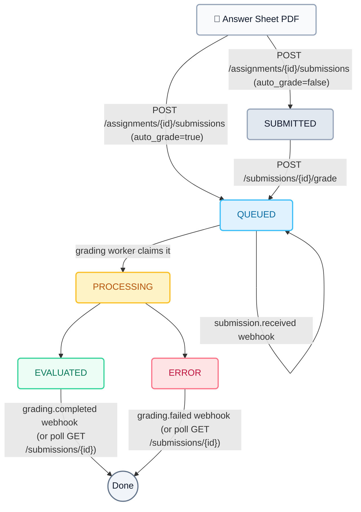

# BigChalkBox Partner API — Reference (v1.3)

The public, server-to-server surface for platforms that resell BigChalkBox:
create tests (by JSON, by paper PDF, or by Markdown template), upload student
answer sheets, and get AI-graded results back — as structured JSON, as the
original files, and as **marked answer sheets**.

- **Base URL:** `https://api.bigchalkbox.com/partner/v1`
- **Auth:** API key (§1)
- **Interaction style:** synchronous REST; grading completes asynchronously — track it by **signed webhooks** (§6) or by polling
- **Interactive docs:** the Swagger UI is **not** exposed publicly — this document is the contract. Companion docs: [Integration Guide](partner-api-integration-guide.md) (architecture, go-live checklist) and [`partner-api-openapi.json`](partner-api-openapi.json) (machine-readable spec).
- **Service:** BigChalkBox Partner API — support details in §11

> **v1.3 (2026-09-23)** adds the **ops surface** (§4.2, §4.3, §4.4):
> `GET /assignments/{id}/analytics` (score bands, problem areas, dashboard
> counts), `GET /assignments/{id}/export?format=xlsx|zip` (server-built
> results roster / marked-PDF bundle), `POST /assignments/{id}/submissions/
> bulk` (batch upload with per-file report), the page-rearrangement pair
> (`GET /submissions/{id}/page-layout`, `PUT /submissions/{id}/page-overrides`),
> and re-grade modes on `POST /submissions/{id}/grade?mode=`
> (`full` | `existing-pages` | `overrides`).
>
> **v1.2 (2026-09-23)** adds the **content door** (§4.6): `POST
> /papers/extract` (question-paper PDF → structured questions), `POST
> /assignments/from-file` (Markdown paper template — FORMAT SPEC v1), and
> `POST /assignments/{id}/bulk-generate` (202 + poll — AI fills missing model
> answers, rubrics and MCQ answers). The create contract is split: the
> **PAPER** (text, marks, MCQ options) is required at create time; the
> **ANSWER KEY** is required at grade time (§3). AI configuration (extraction
> engine, grading provider) stays server-managed — there is no client-facing
> engine or provider parameter.
>
> **v1.1 (2026-09-23)** adds: webhooks (5 endpoints, §6), results & files
> (`/pdf`, `/pages`, `/marked-pdf`, §4.5), and the `osm_enabled` test flag
> (§4.2). Everything in v1 is unchanged unless marked below. Example payloads
> in this document were captured from the live API on 2026-09-23.

---

## Endpoint index (31 routes)

| Group | Method & path | Purpose |
|---|---|---|
| **Account** | `GET /health` | Authenticated smoke check — prove the key works |
| | `GET /me` | Client identity + service account + capabilities |
| | `GET /usage` | Metering snapshot (plan + quota counters) |
| **Tests** | `POST /assignments` | Create a test (questions + rubrics, optional `osm_enabled`) → `201` |
| | `GET /assignments` | List my tests with live submission counts |
| | `GET /assignments/{id}` | Full test detail (questions, rubrics) |
| | `PATCH /assignments/{id}` | Partial update (title, subject, instructions, deadline, status, `osm_enabled`) |
| | `DELETE /assignments/{id}` | Delete a test + its stored PDFs → `204` |
| | `PUT /assignments/{id}/questions` | Full replace of the question set |
| | `PUT /assignments/{id}/rubrics` | Full replace of the rubric set |
| | `GET /assignments/{id}/analytics` | **v1.3** — score bands, problem areas, dashboard counts |
| | `GET /assignments/{id}/export` | **v1.3** — server-built `?format=xlsx` (results roster) or `zip` (marked PDFs) |
| **Submissions** | `POST /assignments/{id}/submissions` | Upload one student's answer-sheet PDF, optionally auto-grade → `201` |
| | `POST /assignments/{id}/submissions/bulk` | **v1.3** — batch upload (up to 50 PDFs) with a per-file report → `200` |
| | `GET /assignments/{id}/submissions` | Roster / gradebook for one test (paginated) |
| **Grading** | `POST /submissions/{id}/grade` | Queue (or re-queue) grading, `?mode=full` (default) \| `existing-pages` \| `overrides` (**v1.3**) → `202` |
| | `GET /submissions/{id}` | Submission status — **the poll endpoint** |
| | `GET /submissions/{id}/page-layout` | **v1.3** — the pages a re-grade can rearrange (presigned URLs) |
| | `PUT /submissions/{id}/page-overrides` | **v1.3** — store/reset a manual page arrangement |
| **Results & files** | `GET /submissions/{id}/results` | Full graded result (per-question report) |
| | `GET /submissions/{id}/pdf` | The submitted sheet — 302 to a 1-hour presigned URL |
| | `GET /submissions/{id}/pages` | Graded page images grouped by question, presigned URLs |
| | `GET /submissions/{id}/marked-pdf` | **v1.1** — the OSM-marked answer sheet as one PDF (requires `osm_enabled`) |
| **Content door** *(v1.2)* | `POST /papers/extract` | Question-paper PDF → structured questions (AI; long-running call) |
| | `POST /assignments/from-file` | Create a test from a Markdown paper template (deterministic, zero-LLM) |
| | `POST /assignments/{id}/bulk-generate` | AI fills missing model answers / rubrics / MCQ answers → `202` + poll |
| **Webhooks** *(v1.1)* | `POST /webhooks` | Register/replace the webhook subscription (secret shown once) |
| | `PATCH /webhooks` | Partial update (url / events / rotate secret) |
| | `GET /webhooks` | Current subscription (never returns the secret) |
| | `GET /webhook-deliveries` | Delivery log — statuses, attempts, last error |
| | `POST /webhook-deliveries/{id}/retry` | Re-queue a dead/pending delivery immediately |

Plus an unauthenticated `GET https://api.bigchalkbox.com/health` load-balancer
probe (§4.1).

---

## Quick start

```bash
export BCB_API_KEY="bcbk_..."   # your key, issued by a BigChalkBox admin

BASE=https://api.bigchalkbox.com/partner/v1

# 1. Prove the key works
curl -s -H "X-API-Key: $BCB_API_KEY" $BASE/health
# {"status": "ok", "client": {"id": 1, "name": "DoonTeddies"}}

# 2. (v1.1) Subscribe to webhooks — the secret is shown exactly once
curl -s -X POST $BASE/webhooks -H "X-API-Key: $BCB_API_KEY" \
  -H "Content-Type: application/json" \
  -d '{"url": "https://your-platform.example/hooks/bigchalkbox"}'
# {"url": "...", "events": ["submission.received", "grading.completed", "grading.failed"],
#  "secret": "bcbwh_...", "updated_at": "..."}   ← store the secret in your secrets manager

# 3. Create a test — hand-built JSON (below), or via the content door (§4.6):
#    POST /papers/extract (paper PDF → questions JSON) then this, or
#    POST /assignments/from-file (Markdown paper template, one call).
#    Add "osm_enabled": true if you want the marked answer sheets back.
curl -s -X POST $BASE/assignments -H "X-API-Key: $BCB_API_KEY" \
  -H "Content-Type: application/json" -d '{ ...questions... }'        # → {"id": 42, ...}

# 4. Upload answer sheets — one by one, or a whole batch (§4.3):
curl -s -X POST $BASE/assignments/42/submissions -H "X-API-Key: $BCB_API_KEY" \
  -F file=@student.pdf -F student_email=riya@example.edu              # → {"submission_id": "...", "status": "QUEUED"}
curl -s -X POST $BASE/assignments/42/submissions/bulk -H "X-API-Key: $BCB_API_KEY" \
  -F files=@a.pdf -F files=@b.pdf -F students='{"a.pdf": {"email": "a@x.edu"}, "b.pdf": {"email": "b@x.edu"}}'
# → {"total": 2, "successful": 2, "failed": 0, "results": [{"filename": "a.pdf", "status": "success", ...}]}

# 5. When your webhook fires grading.completed (or you poll /submissions/$SID):
curl -s -H "X-API-Key: $BCB_API_KEY" $BASE/submissions/$SID/results   # structured report
curl -sL -H "X-API-Key: $BCB_API_KEY" $BASE/submissions/$SID/marked-pdf -o marked.pdf   # visual sheet (osm tests)

# 6. When the cohort is graded — dashboard numbers and files (§4.2):
curl -s -H "X-API-Key: $BCB_API_KEY" $BASE/assignments/42/analytics   # bands, problem areas, counts
curl -sL -H "X-API-Key: $BCB_API_KEY" "$BASE/assignments/42/export?format=xlsx" -o results.xlsx
curl -sL -H "X-API-Key: $BCB_API_KEY" "$BASE/assignments/42/export?format=zip"  -o marked.zip   # osm tests
```

---

## 1. Authentication

Every `/partner/v1` request needs a key, sent either way (send only one; `X-API-Key`
wins if both are present):

```prose
X-API-Key: bcbk_Xk9fT2mQ...
Authorization: Bearer bcbk_Xk9fT2mQ...
```

Key facts:

- Keys look like `bcbk_` followed by ~32 URL-safe characters. Only the `bcbk_`
  prefix (first 12 chars) is ever displayed after issuance — the full raw key is
  shown **exactly once** at creation/rotation; the platform stores only its SHA-256
  hash. If a key is lost, the only option is rotation, which immediately invalidates
  the old one.
- Keys are issued and managed by BigChalkBox admins in the teacher-web admin UI
  (**Admin → API Clients**) — there is no self-service signup yet.
- A key is tied to one service account (`api-client-<name-slug>@api.internal`);
  everything the key creates (assignments, submissions, students) belongs to that
  account and is invisible to every other key. Object references from another
  tenant answer **404**, never 403, so existence is not leaked across tenants.
- **Rotating or disabling a key** is an admin action in the same admin UI.
  Deactivation takes effect immediately on the next request.
- Webhook secrets (§6) follow the same show-once discipline: returned only by the
  `POST`/`PATCH` call that set or rotated them, never by reads.

Auth failures are always:

```json
{"error": {"code": "unauthorized", "message": "Invalid or inactive API key."}}
```

- Missing key → `401` `"Missing API key."`
- Unknown key or deactivated client → `401` `"Invalid or inactive API key."`

Sending an `Authorization` header with any non-Bearer scheme (e.g. `Basic`) is
treated as no key at all.

---

## 2. Conventions

### Error envelope

Every `/partner/*` error is a single JSON shape — FastAPI's `{"detail": ...}` default
is replaced on this surface:

```json
{
  "error": {
    "code": "conflict",
    "message": "A submission for this student already exists and is QUEUED; ...",
    "details": { }
  }
}
```

`details` is present on `422` responses only (the pydantic field errors).

| HTTP | `code` | Typical cause |
|---|---|---|
| 400 | `bad_request` | Semantic problem with an otherwise well-formed request (empty title, PDF limit, closed-assignment upload, delete of an ACTIVE test, invalid webhook URL, non-PDF paper, template parse errors — line-numbered) |
| 401 | `unauthorized` | Missing / invalid / inactive API key |
| 403 | `forbidden` | Reserved (not currently returned by any route) |
| 404 | `not_found` | Assignment/submission/delivery doesn't exist **or** belongs to another key; webhook read before `POST /webhooks` |
| 409 | `conflict` | Duplicate in-flight/graded submission; grading while QUEUED/PROCESSING; results before EVALUATED; retrying an already-delivered webhook; starting bulk-generate while a job is running |
| 413 | — | Request body over ~100 MB, rejected by the proxy (large-file version of the 25 MB per-PDF app limit; raised from ~30 MB in v1.3 for bulk uploads) |
| 422 | `validation_failed` | Body failed schema validation (`details` lists the field errors), or a grading precondition failed (SUBJECTIVE without rubric, MCQ without complete correct answers) |
| 429 | `rate_limited` | Rate limit exceeded (see below) |
| 5xx | `internal_error` | Unexpected server failure — retry with backoff; if it persists, quote the `X-Request-Id` |

### Request ID

Every response carries `X-Request-Id` — the value you sent, or a generated one.
Send your own (e.g. a UUID per logical operation) to correlate a request across
retries, and quote it in support requests: it joins your logs to ours.

### Rate limiting

nginx enforces **20 requests/second sustained per key, with a burst of 40**
(`burst=40 nodelay`; keyless requests are limited per-IP instead). Exceeding it
returns `429` with the same error envelope above, generated at the proxy — the
request never reaches the application, and **no `Retry-After` header is sent
today**, so back off (e.g. 1 s, 2 s, 4 s…) on `429`. Webhook delivery from us to
you is not part of this limit (it originates from our servers, not your key).

### Timestamps

All timestamps are **ISO 8601 in UTC**. Two serializations appear depending on the
endpoint — `2026-09-05T12:11:43.864167Z` (most endpoints) and
`2026-09-05T12:09:15.333561+00:00` (`GET /me`). They are equivalent; parse with a
timezone-aware ISO-8601 parser and never assume a wall-clock local time.

### Pagination

The only paginated endpoint is the roster, `GET /assignments/{id}/submissions`:

- `limit` — page size, **default 50, max 100**; outside `1..100` → `400`.
- `cursor` — opaque token from the previous page's `next_cursor`. Do not
  parse or construct cursors; a corrupt one → `400`.
- Ordering is **newest first**, by `(submitted_at, id)` descending — stable under
  concurrent inserts (keyset pagination; page boundaries never shift while you walk).
- End of data: `next_cursor` is `null`. An empty page returns `{"items": [], "next_cursor": null}`.

Every other list endpoint (`GET /assignments`, `GET /webhook-deliveries`) is
unpaginated (`webhook-deliveries` takes a `limit` up to 100, newest first).

---

## 3. Grading lifecycle



### Status values

| Status | Meaning | `total_score`/`max_score` | `evaluated_at` | `error_log` |
|---|---|---|---|---|
| `SUBMITTED` | PDF stored, grading not requested yet | `null` | `null` | `null` |
| `QUEUED` | Waiting for the grading worker | `null` | `null` | `null` |
| `PROCESSING` | Worker is grading right now | `null` | `null` | `null` |
| `EVALUATED` | Done — fetch `/results`, `/pages`, `/marked-pdf` | set | set | `null` (usually) |
| `ERROR` | Grading failed | `null` | `null` | reason |

(`NOT_SUBMITTED` exists internally for UI-only flows; it is never produced through
this API.)

Lifecycle rules:

- **QUEUED → PROCESSING → EVALUATED | ERROR** is driven entirely by the grading
  worker polling the queue; there is nothing to call to advance it.
- **Completion signal:** you get `grading.completed` / `grading.failed`
  **webhooks** if you've subscribed (§6) — that is the intended primary signal.
  Polling `GET /submissions/{id}` every 2–5 s remains fully supported as a
  fallback (it is far below the rate limit). A typical test grades in tens of
  seconds to a few minutes depending on page count and question count.
- `EVALUATED` → `total_score` / `max_score` / `evaluated_at` are set; fetch the
  per-question detail via `GET /submissions/{id}/results` and the files via
  §4.5.
- `ERROR` → `error_log` carries the reason (also surfaced in the roster and on
  the status endpoint). Fix the cause (usually a rubric/coverage problem) and
  re-queue with `POST /submissions/{id}/grade` — regrading clears `error_log`.
- Regrading an `EVALUATED` submission (e.g. after the rubrics were improved, or
  after flipping `osm_enabled`) resets `report`, `total_score`, `max_score`,
  `evaluated_at`, and `error_log`, then re-queues. Each completed grading run
  fires its own `grading.completed` webhook. Grading is **never** in-place while
  QUEUED/PROCESSING — a second grade call while in flight is `409`.

### Grading preconditions

A submission can only be queued when **every question is covered** (v1.2 — the
answer-key requirement moved here, out of create-time):

- every **SUBJECTIVE** question has a rubric (via `PUT /assignments/{id}/rubrics`,
  embedded in the question set, or filled by `POST /assignments/{id}/bulk-generate`), and
- every **MCQ** has complete `correct_answers` — top-level, or on every
  option-bearing `sub_question`.

Violating either is `422`, e.g.:

```json
{"error": {"code": "validation_failed",
           "message": "Question 3 has no rubric; grading it would score against empty criteria. Set rubrics via PUT /assignments/{id}/rubrics first."}}
```

```json
{"error": {"code": "validation_failed",
           "message": "Question 2 is an MCQ with no complete correct answers; grading it would score against nothing. Complete them via PUT /assignments/{id}/questions or POST /assignments/{id}/bulk-generate first."}}
```

MCQ-only assignments need no rubrics at all — MCQs are matched against
`correct_answers`. This split is what lets the content door (§4.6) create
key-less tests: they are legal to create and upload to, and the gate simply
refuses to queue grading until the key exists.

### OSM (on-screen marking) — new in v1.1

Create the test with `"osm_enabled": true` and the grader additionally
**annotates the student's own pages** — ticks/crosses per rubric criterion and a
handwritten-style examiner remark — while it grades. The annotated sheets are
packed into `GET /submissions/{id}/marked-pdf` (one PDF, score badge on page 1).
Default is `false` (plain JSON scoring — cheaper, and what most integrations
want). Toggling the flag after grading only affects **future** grading runs:
re-queue a submission to re-grade it with the new setting.

### Re-grade modes (v1.3) — `POST /submissions/{id}/grade?mode=`

Re-grading an `EVALUATED` submission comes in three modes:

| `mode` | What runs | When to use |
|---|---|---|
| `full` *(default)* | The whole pipeline again: PDF → page images → classify → segment → grade. Resets the current report/scores. | After changing the assignment (questions, rubrics, `osm_enabled`), or after an `ERROR`. |
| `existing-pages` | Re-grades **every** question from the page images the last run already produced — no PDF re-render, no re-classification, no re-segmentation. The report is **kept** until the new run replaces it. | The fast option: e.g. after a rubric or model-answer tweak where the pages are already correct. |
| `overrides` | Re-grades **only the questions whose pages you rearranged** via `PUT /submissions/{id}/page-overrides`, then **bakes** the arrangement into storage (the pages become the arrangement; the stored override is cleared and `page-layout` reports `override: null` afterwards). | After fixing a mis-scanned sheet — move a page to the right question and re-grade just the affected ones. |

Semantics:

- Fast modes (`existing-pages`, `overrides`) require the submission to be
  `EVALUATED` with a report — `400` otherwise. `overrides` additionally
  requires a stored, active page arrangement — `400` if there is none.
- While a run is in flight (`QUEUED`/`PROCESSING`) the fast modes are
  **idempotent `202`** (no-op); `full` keeps the v1.2 behavior of `409`.
- The §3 grading preconditions still apply to **every** mode (`422` if the
  answer key was removed since the last run) — a re-grade can never silently
  score against nothing.
- Unchanged questions in a fast mode keep their existing results; only what
  the run re-grades is replaced. Page-usage metering is **not** repeated in
  fast modes (pages were metered at first grading).
- Every completed re-grade fires its own `grading.completed` webhook, and
  `/analytics` + `/export` reflect the new scores as soon as it lands.

---

## 4. Endpoints

All routes are relative to `https://api.bigchalkbox.com/partner/v1`. Every example
below assumes the key in an env var:

```bash
export BCB_API_KEY="bcbk_..."
```

### 4.1 Health & account

#### `GET /health` — authenticated smoke check

Proves the key works. Use this (not the bare probe below) in integration tests.

```bash
curl -s -H "X-API-Key: $BCB_API_KEY" https://api.bigchalkbox.com/partner/v1/health
```

```json
{"status": "ok", "client": {"id": 1, "name": "Example Partner"}}
```

#### `GET /me`

Client identity plus the service account it acts as. `capabilities` documents the
surface — v1.1 keys are unscoped (every key can do everything).

```json
{
  "client": {"id": 1, "name": "Example Partner", "key_prefix": "bcbk_Qk3xR7vNp2", "created_at": "2026-09-01T08:00:00+00:00"},
  "service_account": {"user_id": 41, "email": "api-client-example-partner@api.internal"},
  "capabilities": ["assignments:read", "assignments:write", "submissions:read",
                   "submissions:write", "grading", "roster:read", "usage:read"]
}
```

> `capabilities` is a description of the surface, not a gate — v1.1 keys are
> unscoped and can also use the results/file endpoints (§4.5) and webhooks
> (§6); the list will be extended in a future version.

#### `GET /usage`

Metering snapshot for the client's service account (plan + usage counters).
Read-only today — enforcement on partner routes lands in a later phase; this lets
platforms meter what they resell before that. `limit: null` means unlimited
(subscribed accounts); limits can also be per-account admin overrides, so treat
them as authoritative rather than assuming any default:

```json
{
  "plan": "FREE",
  "quotas": {
    "tests": {"used": 1, "limit": 2},
    "moderations": {"used": 0, "limit": 1},
    "major_paper_generations": {"used": 0, "limit": 1}
  }
}
```

#### `GET /health` on the bare host (no auth, outside `/partner/v1`)

`GET https://api.bigchalkbox.com/health` → `{"status": "healthy", "service": "partner-api"}`
for load balancers / uptime monitors. It uses FastAPI's default response shape and
requires no key.

### 4.2 Assignments

A partner assignment is a test: questions + (for SUBJECTIVE) rubrics. API-created
assignments are born `ACTIVE` and immediately accept submissions — there is no UI
activation step.

#### `POST /assignments` → 201

```bash
curl -s -X POST https://api.bigchalkbox.com/partner/v1/assignments \
  -H "X-API-Key: $BCB_API_KEY" -H "Content-Type: application/json" \
  -d '{
    "title": "Midterm — Physics 101",
    "subject": "Physics",
    "instructions": "Answer all questions.",
    "osm_enabled": true,
    "questions": [
      {
        "question_number": "1",
        "question_text": "State Newton'\''s second law.",
        "max_marks": 5,
        "question_type": "SUBJECTIVE",
        "model_answer": "F = ma, force equals mass times acceleration.",
        "rubric": [{"criteria": "States F = ma", "max_marks": 5}]
      },
      {
        "question_number": "2",
        "question_text": "The SI unit of force is:",
        "max_marks": 1,
        "question_type": "MCQ",
        "options": ["newton", "joule", "watt", "pascal"],
        "correct_answers": ["newton"]
      }
    ]
  }'
```

```json
{"id": 42, "title": "Midterm — Physics 101", "status": "ACTIVE", "num_questions": 2, "created_at": "2026-09-22T20:01:28.158941Z"}
```

Top-level body fields:

| Field | Type | Notes |
|---|---|---|
| `title` | string | Required, non-blank |
| `subject` | string? | |
| `instructions` | string? | Shown to students in your own UI; not rendered by us |
| `questions` | object[] | Required, ≥1 — schema below |
| `osm_enabled` | bool? | **v1.1.** Default `false`. `true` → the grader annotates the student's pages; `GET /submissions/{id}/marked-pdf` then returns the marked sheet (§4.5) |

Errors: empty/whitespace title or no questions → `400`; malformed body → `422`
(envelope `details` lists field errors); question-level validation failures →
`400` naming the offending `question_number` (see the rules below). Answer-key
gaps (missing rubrics / MCQ answers) are **not** create errors anymore (v1.2) —
they surface at grade time (§3).

**Question schema** (all questions):

| Field | Type | Notes |
|---|---|---|
| `question_number` | string | Required. Any label ("1", "2b", "Q3") |
| `question_text` | string | Required, non-blank. LaTeX is allowed and rendered in reports |
| `max_marks` | number | Required, > 0 |
| `question_type` | `"MCQ"` \| `"SUBJECTIVE"` | Default `"SUBJECTIVE"` |
| `section_label` | string? | Optional grouping |
| `or_group` | string? | Questions sharing an `or_group` are alternatives — the student answers one of them; the grader picks the credited attempt and marks the others `skipped_or_alternative` in the report |
| `options` / `correct_answers` | string[]? | MCQ only — `options` required at create (v1.2); `correct_answers` may be absent (fill via bulk-generate §4.6 or a later `PUT`) |
| `sub_questions` | object[]? | Raw passthrough for MCQ option sets (canonical storage shape) |
| `model_answer` | string? | SUBJECTIVE reference answer |
| `model_answers` | `{text, rubric?}[]` | SUBJECTIVE, multiple accepted variants |
| `rubric` | `{criteria, max_marks}[]`? | SUBJECTIVE rubric, question-level |

**Validation rules** (enforced at create and at `PUT .../questions`; split in
v1.2 — the create-time rules check the PAPER, the grade-time gate (§3) checks
the ANSWER KEY):

- Every question needs `question_text` + positive `max_marks` (`400`).
- MCQ needs `options` — top-level or inside `sub_questions` (`400`).
  `correct_answers` is **not** required here anymore.
- SUBJECTIVE may be created with no model answer and no rubric (the content
  door's key-less papers are legal). When a rubric is present — question-level
  or embedded on model answers — it is materialized into `rubrics_json`.

Grading an uncovered question is refused with `422` naming it (§3) — nothing
can ever grade silently against empty content.

#### `GET /assignments` — list mine

Newest first, with live submission counts. Unpaginated (returns all your tests):

```json
[{"id": 42, "title": "Midterm — Physics 101", "subject": "Physics", "status": "ACTIVE", "num_submissions": 7, "created_at": "2026-09-05T10:00:00+00:00"}]
```

#### `GET /assignments/{id}` — full detail

Adds `instructions`, `questions_json` (canonical stored shape), `rubrics_json`
and — **v1.2** — the bulk-generate job state (`bulk_gen_status` /
`bulk_gen_progress`, `null` until `POST …/bulk-generate` is called; §4.6) to the
summary fields:

```json
{
  "id": 42, "title": "Midterm — Physics 101", "subject": "Physics", "status": "ACTIVE",
  "num_submissions": 7, "created_at": "2026-09-05T10:00:00+00:00",
  "instructions": "Answer all questions.",
  "questions_json": {"questions": [ ...as stored... ]},
  "rubrics_json": [{"question_number": "1", "criteria": [{"criteria": "States F = ma", "max_marks": 5.0}]}],
  "bulk_gen_status": null,
  "bulk_gen_progress": null
}
```

While a job runs: `"bulk_gen_status": "RUNNING"`,
`"bulk_gen_progress": {"current": 3, "total": 7, "label": "Q3", "mode": "all"}`.
This is the **poll endpoint** for `POST …/bulk-generate`. Unknown id or another
key's test → `404`.

#### `PATCH /assignments/{id}` — partial update

Send only the fields you're changing:

| Field | Notes |
|---|---|
| `title` | empty/whitespace → `400` |
| `subject` | |
| `instructions` | |
| `deadline` | ISO 8601; a timezone-naive value is interpreted as **IST** (UTC+5:30). Metadata only — the API does not auto-close at the deadline |
| `status` | `"DRAFT"` \| `"ACTIVE"` \| `"CLOSED"` — any transition is accepted; `CLOSED` stops new uploads (§4.3) |
| `osm_enabled` | **v1.1.** Toggles on-screen marking for **future** grading runs; existing graded reports are untouched until re-queued |

Unknown fields are ignored; UI-only toggles (`require_secure_login`,
`submission_mode`) are not part of the external contract. Response is the full
detail object (same shape as `GET /assignments/{id}`).

#### `DELETE /assignments/{id}` → 204

Deletes the test, its submissions, and the stored answer-sheet PDFs. An `ACTIVE`
assignment is refused with `400` (`"Close the assignment before deleting it."`) so a
stray call can't destroy a live collection target. `CLOSED`/`DRAFT` assignments
delete fine. Repeating a successful delete → `404`. Response body is empty.

#### `PUT /assignments/{id}/questions` — full replace

Same payload and validation as create. **This replaces the entire question set**,
and rubrics are re-materialized together with it (question-level rubrics move with
their questions — an explicit rubric update would otherwise be silently stale).
Response is the full detail object. Use this to fix typos or restructure a test
*before* submissions exist; changing questions after grading does not automatically
re-grade — re-queue each submission with `POST /submissions/{id}/grade`.

#### `PUT /assignments/{id}/rubrics` — full replace

```json
{"rubrics": [{"question_number": "1", "criteria": [{"criteria": "States F = ma", "max_marks": 5}]}]}
```

Stored as given. Coverage is **not** checked here — a partial set can be staged
across calls; the check happens at grading time (§3). Response is the full detail
object.

#### `GET /assignments/{id}/analytics` — v1.3

The headline numbers for a test's results page: cohort status counts, the
score distribution, and the questions students struggled with most. No
parameters.

```json
{
  "total_submissions": 24,
  "submitted_count": 2,
  "evaluated_count": 20,
  "pending_count": 1,
  "processing_count": 1,
  "error_count": 0,
  "score_distribution": [
    {"label": "0-20%", "count": 1}, {"label": "21-40%", "count": 4},
    {"label": "41-60%", "count": 7}, {"label": "61-80%", "count": 5},
    {"label": "81-100%", "count": 3}
  ],
  "problem_areas": [
    {"question_number": "3", "question_text": "Derive the lens formula…", "average_score_percentage": 31.5},
    {"question_number": "7", "question_text": "Explain total internal reflection…", "average_score_percentage": 44.0}
  ],
  "average_score": 58.2
}
```

Field notes:

- Counts span **all** submissions of the test; `pending` is the residual
  (`NOT_SUBMITTED` + `QUEUED`).
- `score_distribution` bands are integer-inclusive over **EVALUATED** rows
  (`max_score > 0`): a student at exactly 20.5% falls in *no* band, so the
  band counts can sum to less than `evaluated_count`.
- `average_score` = mean percentage over EVALUATED rows, 1 decimal, or `null`
  when nothing is evaluated yet (a genuine 0.0 average is reported as `0.0`,
  not `null`).
- `problem_areas` = the questions in the **3 worst distinct** average-percentage
  tiers (a tie at the cutoff keeps every tied question, capped at 10). OR-group
  alternatives the student did not attempt are excluded — they can't be
  misread as "everyone failed Q5b". Empty list when nothing is evaluated (or
  the reports carry no per-question rows).
- Per-student detail is not here — that's the roster (`GET
  /assignments/{id}/submissions`) plus `GET /submissions/{id}/results`.

#### `GET /assignments/{id}/export?format=` — v1.3 (S1=B)

The server builds the file; you download it. `Content-Disposition:
attachment` on both. Unknown ids / another key's test → `404`; a test with no
submissions (or only ungraded ones) → `400`.

| `format` | File | Contents |
|---|---|---|
| `xlsx` *(default)* | `<Test Title>_Results.xlsx` | The full results roster, one row per student who submitted: `Student Name`, `Student ID` (email local-part, falling back to enrollment number), one `Q<n>` column per question seen across the cohort (natural order — Q2 before Q10) carrying **marks obtained** (`0` when the question graded to a null score, the string `NA` when the student has no result row for it), and `Total Score` (`NA` while ungraded). Rows are newest-submission-first, sheet name `Results`. This matches the teacher UI's Excel export column-for-column. |
| `zip` | `<Test Title>_Marked_PDFs.zip` | One **marked PDF** per `EVALUATED` submission (members named `report_<Student_Name>_<id-prefix>.pdf`), the same files as `GET /submissions/{id}/marked-pdf`. **OSM tests only** — `400` on a non-OSM test (there are no marked sheets to pack). Submissions without annotated pages are skipped; if none have them → `404`. Hard cap: 100 evaluated submissions per zip (`400` above it — fetch per-submission instead). |

File-name titles are sanitized (whitespace runs → `_`, filename-hostile
characters → `_`), so `Midterm — Physics 101` becomes `Midterm_—_Physics_101_Results.xlsx`.

```bash
curl -sL -H "X-API-Key: $BCB_API_KEY" \
  "https://api.bigchalkbox.com/partner/v1/assignments/42/export?format=xlsx" -o results.xlsx
curl -sL -H "X-API-Key: $BCB_API_KEY" \
  "https://api.bigchalkbox.com/partner/v1/assignments/42/export?format=zip"  -o marked_sheets.zip
```

### 4.3 Submissions

#### `POST /assignments/{id}/submissions` → 201

Upload one student's answer sheet as a **single PDF** (≤ 25 MB, filename must end
`.pdf`) and optionally queue it for grading in the same call. `Content-Type` must
be `multipart/form-data`.

```bash
curl -s -X POST https://api.bigchalkbox.com/partner/v1/assignments/42/submissions \
  -H "X-API-Key: $BCB_API_KEY" \
  -F "file=@student_answer_sheet.pdf" \
  -F "student_email=riya.kapoor@example.edu" \
  -F "student_name=Riya Kapoor" \
  -F "enrollment_number=ENR-2026-114" \
  -F "auto_grade=true"
```

```json
{"submission_id": "6f0c9a2e-3b1d-4c8a-9e2f-7a1b2c3d4e5f", "status": "QUEUED", "student_email": "riya.kapoor@example.edu", "auto_grade": true}
```

| Form field | Required | Notes |
|---|---|---|
| `file` | yes | PDF only; > 25 MB → `400` (a body over ~100 MB is cut off earlier by the proxy with `413`) |
| `student_email` | yes | Must contain `@`; lowercased on store. The student record is upserted by this email (name/enrollment updated on re-upload) |
| `student_name` | no | Defaults to enrollment number, then the email local-part |
| `enrollment_number` | no | Stored on the student record |
| `auto_grade` | no | Default `true` — queue for grading immediately. Send the strings `"true"`/`"false"` |

Behavior details:

- `auto_grade=true` validates rubric coverage first: a missing rubric → `422`.
  **Nothing is committed** — no submission row, no student record is created — so
  fixing the rubrics and re-sending the same upload is clean.
- `auto_grade=false` stores as `SUBMITTED`; grade later via §3 / §4.4.
- **Closed assignments** reject uploads outright — `400`
  (`"This assignment is CLOSED and no longer accepts submissions."`). Closing
  (`PATCH` → `status: "CLOSED"`) is how you stop a collection target; reopening
  (`PATCH` back to `ACTIVE`) re-opens it. Regrading submissions that already exist
  stays allowed after a close.
- The student record is created/updated on every accepted upload — a later upload
  for the same email with a different name updates the name.
- **v1.1:** an accepted upload fires a `submission.received` webhook (§6) in the
  same transaction as the store — it cannot be lost.

**Duplicate handling** — one submission row per (assignment, student):

- Existing row is `QUEUED`/`PROCESSING`/`EVALUATED` → **`409`**, and the PDF is
  **not** uploaded (retry storms don't orphan files in storage). Poll the existing
  `submission_id` instead of re-uploading.
- Existing row is `SUBMITTED`/`ERROR` (or has no file) → the row is **reused**:
  same `submission_id`, new PDF replaces the old one, status resets to
  `SUBMITTED` (or `QUEUED` with `auto_grade=true`). The response still says 201.

Use the 409 contract as your de-facto idempotency mechanism: if you aren't sure an
upload landed (e.g. a timeout), re-send it — either you get a fresh 201, or a 409
pointing at work already in flight.

#### `POST /assignments/{id}/submissions/bulk` — v1.3 (batch upload)

Upload a whole batch of answer sheets in one request — the scanned-photos
workflow. `Content-Type: multipart/form-data` with a **repeated `files` field**
(1–50 PDFs, ≤ 25 MB each; the request body cap is ~100 MB, so batch
full-size scans into a few requests).

**Per-file identity — two ways, the explicit map wins:**

| Form field | Required | Notes |
|---|---|---|
| `students` | one of these two | JSON **object** mapping each uploaded filename (exact match, all files) to `{"email": "...", "name"?: "...", "enrollment_number"?: "..."}`. Emails are lowercased; unknown/mismatched keys → `400` naming the missing/unknown filenames |
| `email_domain` | one of these two | Your students' email domain, e.g. `students.acme.edu`. Filenames are then parsed as **`[ID]_[First]_[Last]_[extra].pdf`**: `ID` becomes `ID@your_domain`, the non-numeric name parts are joined as the student's name (`J123_John_Doe_15.pdf` → `j123@students.acme.edu`, "John Doe" — trailing counters like `_15` are dropped). An `ID` that already contains `@` (a full email in the filename) is used as-is, no domain glued on |
| `auto_grade` | no | Default `true` (strings `"true"`/`"false"`) — same semantics as the single upload |

Either field missing → `400`. More than 50 files → `400`. A `CLOSED`
assignment → `400` for the whole request.

**Response is always `200`** with a per-file report — individual failures never
fail the request:

```json
{
  "total": 3, "successful": 2, "failed": 1,
  "results": [
    {"filename": "J123_John_Doe_15.pdf", "status": "success", "message": "Uploaded successfully.",
     "student_email": "j123@students.acme.edu", "submission_id": "6f0c9a2e-...", "submitted_status": "QUEUED"},
    {"filename": "scan_0042.pdf", "status": "success",
     "message": "Uploaded as SUBMITTED; auto-grade refused: Question 1 has no rubric; …",
     "student_email": "scan.0042@students.acme.edu", "submission_id": "ab1d-...", "submitted_status": "SUBMITTED"},
    {"filename": "J456_Any_One.pdf", "status": "error",
     "message": "Existing submission is EVALUATED and cannot be replaced while in flight or graded; re-grade via POST /submissions/{id}/grade instead.",
     "student_email": "j456@students.acme.edu", "submission_id": "cd2e-...", "submitted_status": null}
  ]
}
```

Per-file outcomes:

- `success` + `submitted_status: "QUEUED"` — stored and auto-graded (the normal case).
- `success` + `submitted_status: "SUBMITTED"` — stored, but `auto_grade` was off
  **or** the answer key isn't grade-ready yet (§3 gate). The file is safe; queue
  it later with `POST /submissions/{id}/grade`. (Unlike the single upload's
  `422`, a batch gate-refusal does not discard the upload.)
- `error` — not a PDF; over 25 MB; duplicate filename inside this batch (both
  copies are flagged — a JSON map can't carry two identities per filename);
  unresolvable identity; or an existing submission that is `QUEUED`/
  `PROCESSING`/`EVALUATED` (the `submission_id` in the item points at it).
- An existing `SUBMITTED`/`ERROR` row **is** replaced — same `submission_id`,
  the new PDF overwrites the old one in place.

Each accepted file stores its student record (upsert by email), fires its own
`submission.received` webhook in the same transaction as the store (§6), and —
when auto-queued — flows through the ordinary grading lifecycle (§3).

```bash
# explicit map
curl -s -X POST $BASE/assignments/42/submissions/bulk -H "X-API-Key: $BCB_API_KEY" \
  -F "files=@a.pdf" -F "files=@b.pdf" \
  -F 'students={"a.pdf": {"email": "a@example.edu", "name": "Asha A"}, "b.pdf": {"email": "b@example.edu"}}'

# naming convention
curl -s -X POST $BASE/assignments/42/submissions/bulk -H "X-API-Key: $BCB_API_KEY" \
  -F "files=@J123_John_Doe_15.pdf" -F "files=@J456_Any_One_2.pdf" \
  -F "email_domain=students.acme.edu" -F "auto_grade=true"
```

#### `GET /assignments/{id}/submissions` — roster / gradebook

Every student's status and score for one test. Newest first (§2 Pagination). The
per-question report is deliberately **not** included — fetch it per submission.

```bash
curl -s -H "X-API-Key: $BCB_API_KEY" \
  "https://api.bigchalkbox.com/partner/v1/assignments/42/submissions?limit=2"
```

```json
{
  "items": [
    {"submission_id": "6f0c9a2e-...", "status": "EVALUATED", "student_email": "riya.kapoor@example.edu",
     "student_name": "Riya Kapoor", "student_enrollment_number": "ENR-2026-114",
     "total_score": 4.5, "max_score": 6.0, "page_count": 2, "error_log": null,
     "submitted_at": "2026-09-05T10:02:00+00:00", "evaluated_at": "2026-09-05T10:03:41+00:00"},
    {"submission_id": "ab1d...", "status": "ERROR", "student_email": "arjun@example.edu",
     "student_name": "Arjun", "student_enrollment_number": null,
     "total_score": null, "max_score": null, "page_count": 1,
     "error_log": "segmentation failed: ...", "submitted_at": "2026-09-05T10:01:00+00:00", "evaluated_at": null}
  ],
  "next_cursor": "WyIyMDI2LTA5LTA1VDEwOjAxOjAwKzAwOjAwIiwiYWIxZC4uLiJd"
}
```

A `null` `next_cursor` ends the walk. `page_count` is present once the grader has
inspected the PDF.

### 4.4 Grading

#### `POST /submissions/{submission_id}/grade` → 202

Queue (or re-queue) for grading. Response is the current status object
(`status: "QUEUED"`, all result fields reset to `null`).

**`?mode=` (v1.3)** — `full` (default, backward-compatible) | `existing-pages` |
`overrides`. Full semantics in §3 "Re-grade modes"; in short:

- `full` — the whole pipeline again; resets report/scores.
  - `QUEUED`/`PROCESSING` → `409` (`"Submission is already QUEUED."`)
  - Never uploaded a file → `400`
  - Rubric coverage missing → `422` (names the offending question — §3)
  - Otherwise resets all result fields and queues: works from `SUBMITTED`,
    `EVALUATED` (re-grade after rubric improvements), or `ERROR`.
- `existing-pages` / `overrides` — the fast modes; require `EVALUATED` with a
  report (`400` otherwise) and keep the current report until the new run
  replaces it. `overrides` also requires a stored page arrangement
  (`PUT …/page-overrides`, below). While in flight they are idempotent `202`
  (a `full` call stays `409`). The §3 answer-key gate still applies (`422`).

```bash
curl -s -X POST -H "X-API-Key: $BCB_API_KEY" \
  https://api.bigchalkbox.com/partner/v1/submissions/6f0c9a2e-.../grade
curl -s -X POST -H "X-API-Key: $BCB_API_KEY" \
  "https://api.bigchalkbox.com/partner/v1/submissions/6f0c9a2e-.../grade?mode=existing-pages"
```

#### `GET /submissions/{submission_id}` — status (the poll endpoint)

```json
{"submission_id": "6f0c9a2e-...", "status": "PROCESSING", "error_log": null,
 "total_score": null, "max_score": null,
 "submitted_at": "2026-09-05T10:02:00+00:00", "evaluated_at": null}
```

Poll until `EVALUATED` or `ERROR` — or wait for the `grading.completed` /
`grading.failed` webhooks instead (§6).

#### `GET /submissions/{submission_id}/page-layout` — v1.3

The page-rearrangement payload: which page images exist for a graded
submission, and any stored manual arrangement. Useful after a messy scan —
see if a page landed under the wrong question before re-grading.

```json
{
  "originals": [{"path": "page_001.png", "url": "https://...presigned..."}],
  "by_question": {
    "q1":  [{"path": "q1/page_001.png", "url": "https://...presigned..."}],
    "q2":  [{"path": "q2/page_001.png", "url": "https://...presigned..."}],
    "qMCQs": [{"path": "qMCQs/page_001.png", "url": "https://...presigned..."}]
  },
  "override": null
}
```

- `originals` — full pages that ended up in no question directory (the
  un-bifurcated remainder).
- `by_question` — the grader's per-question page crops, grouped by directory
  (`q1`, `q2a`, `qMCQs`, …); annotated renders are excluded (they are display
  outputs, never grading inputs).
- Every `url` is a **1-hour presigned GET** — fetch the image directly, no
  second API call.
- `override` — the stored arrangement (below) when one is active, else `null`.
- Before any grading run the lists are empty (pages only exist once the
  grader has bifurcated the sheet).

#### `PUT /submissions/{submission_id}/page-overrides` — v1.3

Store (or reset) a **manual page arrangement**: which pages each question
should be graded from. This is a *view* — nothing is moved until you re-grade
with `?mode=overrides`, which re-grades the affected questions from your order
and then bakes the arrangement into storage (after which `override` reads
`null` again and the pages simply *are* the arrangement).

```json
// body — send only the questions you changed; an empty list = "not attempted"
{"enabled": true,
 "questions": {
   "2": ["q2/page_001.png", "page_001.png"],
   "3": []
 }}

// reset (discards the stored arrangement)
{"enabled": false}
```

```json
{"override": {"enabled": true, "updated_at": "2026-09-23T10:00:00+00:00", "questions": {"2": ["q2/page_001.png", "page_001.png"], "3": []}}}
```

Validation (all `400`, every problem in one message): a question number must
belong to the assignment or to a directory the grader produced; every path
must exist in this submission's live page listing (no traversal, no foreign
keys); ≤ 20 images per question; `enabled: true` needs at least one entry.
Response is `{"override": {...}}` or `{"override": null}` on reset.

**The typical repair flow:** `GET …/page-layout` → see page X sits under the
wrong question → `PUT …/page-overrides` with X moved → `POST …/grade?mode=
overrides` → poll → done. Only the moved questions are re-graded (and re-metered
for AI, not for pages); everyone else's results are untouched.

### 4.5 Results & files

#### `GET /submissions/{submission_id}/results` — full result

`409` unless status is `EVALUATED` (`"Submission is not evaluated yet (status: QUEUED)."`).

```json
{
  "submission_id": "6f0c9a2e-...", "status": "EVALUATED", "error_log": null,
  "total_score": 4.5, "max_score": 6.0,
  "submitted_at": "2026-09-05T10:02:00+00:00", "evaluated_at": "2026-09-05T10:03:41+00:00",
  "assignment_title": "Midterm — Physics 101",
  "student_email": "riya.kapoor@example.edu",
  "report": { ...see §5... }
}
```

#### `GET /submissions/{submission_id}/pdf` *(v1.1)*

The student's submitted sheet as stored. `302` to a **1-hour presigned URL** on
our object storage — follow the redirect (e.g. `curl -L`). There is nothing to
save from the response body itself.

- No stored file (e.g. the upload row exists but carries no PDF) → `404`
- Another key's submission → `404` (cross-tenant rule, §1)

```bash
curl -sL -H "X-API-Key: $BCB_API_KEY" $BASE/submissions/$SID/pdf -o original.pdf
```

#### `GET /submissions/{submission_id}/pages` *(v1.1)*

The graded page images, **grouped by question directory** (`q1`, `q2a`, `qMCQs`,
…) — the same grouping the grader established, so your UI can show "page images
for question N". Every entry carries its own 1-hour presigned URL (images are
PNG/JPEG). Page order within a group is by page number (deterministic).

```json
{
  "q1":  [{"id": 12, "page_number": 1, "url": "https://<bucket>.r2.cloudflarestorage.com/submissions/42/6f0c9a2e-.../pages/q1/page_001.png?X-Amz-...=..."}],
  "qMCQs": [{"id": 14, "page_number": 1, "url": "https://.../pages/qMCQs/page_001.png?X-Amz-...=..."}]
}
```

- Ungraded submissions have no pages yet → `{}` (empty object), not an error.
- For OSM tests these are the **original** crops; the annotated variants are what
  `/marked-pdf` packs (they are not listed separately).

#### `GET /submissions/{submission_id}/marked-pdf` *(v1.1 — the returned sheet)*

For tests created with `osm_enabled: true`: streams **one PDF** of the student's
own pages with the grader's marks on them — per-criterion ticks/crosses and the
examiner's remark, in the order the report presents the questions (the shared MCQ
block first, then questions in report order), with the total-score badge stamped
on page 1. Response headers:

```json
HTTP/1.1 200 OK
Content-Type: application/pdf
Content-Disposition: attachment; filename="report_Riya_Kapoor_6f0c9a2e.pdf"
```

The filename is derived from the student's stored name (alphanumerics only) + an
id prefix — safe to use directly for downloads.

| Condition | Response |
|---|---|
| Not `EVALUATED` yet | `409` "Submission has not been evaluated yet" |
| Test was created without `osm_enabled` | `400` "This export is only available for tests created with osm_enabled=true" |
| Evaluated + OSM, but no annotated pages in the report | `404` "No annotated pages found for this submission" |
| Another key's submission | `404` (cross-tenant rule) |

A single missing/corrupt annotated page does not sink the export — the remaining
pages are packed and the PDF is returned.

```bash
curl -sL -H "X-API-Key: $BCB_API_KEY" $BASE/submissions/$SID/marked-pdf -o marked_sheet.pdf
```

### 4.6 Content door *(v1.2)* — creating tests without hand-built JSON

Three endpoints replace manual question entry: extract questions from a scanned
paper PDF, create a test from a Markdown template, and let AI fill in whatever
the answer key is missing.

**The recommended loop:**

```prose
POST /papers/extract            paper PDF  → questions JSON (review it)
        or
POST /assignments/from-file     markdown template → test (one call)
                ↓
POST /assignments               create the test (extracted or adjusted questions)
                ↓
POST /assignments/{id}/bulk-generate   AI fills missing model answers / rubrics / MCQ answers
                ↓
upload + grade (the §3 gate refuses until every question is covered)
```

AI configuration for all three (extraction engine, generation provider) is
**managed by BigChalkBox server-side** — there is no engine or provider
parameter anywhere in these requests. What your tests are graded with, and how
papers are read, can change under you at any time by design.

#### `POST /papers/extract` → 200 — paper PDF to structured questions

Send a **question-paper PDF** (≤ 25 MB, filename must end `.pdf`); the platform
reads it with its AI pipeline and returns the structured questions. The response
is the extraction payload passed through unchanged:

```bash
curl -s -X POST $BASE/papers/extract -H "X-API-Key: $BCB_API_KEY" \
  -F file=@question_paper.pdf -o extracted.json
```

```json
{
  "questions": [
    {"q_number": 1, "question_text": "State Newton's second law of motion and write its mathematical form.",
     "max_marks": 2.0, "question_type": "SUBJECTIVE", "page_found_on": 1,
     "or_group": null, "sub_questions": null, "options": null, "correct_answers": null},
    {"q_number": 2, "question_text": "The SI unit of force is: (a) joule (b) newton (c) watt (d) pascal",
     "max_marks": 1.0, "question_type": "MCQ", "page_found_on": 1,
     "sub_questions": null, "options": ["joule", "newton", "watt", "pascal"], "correct_answers": null}
  ],
  "total_marks": 3.0,
  "extraction_confidence": 0.9,
  "sections_meta": []
}
```

| Field | Notes |
|---|---|
| `questions[].q_number` | int or string ("3a" for OR-sub-questions). Map it to `question_number` when you create the test |
| `questions[].question_text` | LaTeX passes through as written |
| `questions[].max_marks` | as printed on the paper |
| `questions[].question_type` | `SUBJECTIVE` \| `MCQ` (extraction never emits the internal `FILL_BLANKS`) |
| `questions[].sub_questions` | MCQ sub-question groups: `{sub_q_number, text, options, correct_answers}` — `correct_answers` comes back **null**: extraction reads the paper, it doesn't know the key |
| `questions[].options` / `correct_answers` | flat MCQs |
| `page_found_on` | global 1-based page in the PDF |
| `or_group`, `section_label`, `division_label`, `bloom_level`, `difficulty_level`, `co_mapping` | set when the paper implies them, else null |
| `extraction_confidence` | 0–1, the **minimum** across the paper's reading batches — below 1.0 is normal. Treat the output as a draft: **review before creating the test** |

This is a **long-running synchronous call** — a large paper can take tens of
minutes (reading happens in 15-page batches). Use a client read timeout of at
least **30 minutes**; the platform's proxy allows up to 50. There is no
polling variant; the request simply stays open until the paper is read.

| Condition | Response |
|---|---|
| Not a PDF / > 25 MB / empty | `400` |
| Upstream rejected the paper (unreadable, no pages) | `400` `"Extraction failed: …"` |
| Our AI side unavailable / exhausted retries / non-JSON upstream | `502` — retry later |

#### `POST /assignments/from-file` → 201 — create a test from a Markdown template

Deterministic (zero-LLM) creation from a Markdown file. The template carries the
**paper** (question text, marks, MCQ options) and, optionally, the **answer key**
(model answers, rubrics, MCQ correct answers) in the same file. Send either a
`.md`/`.markdown` **file** or the **`md_text`** form field — not both. Optional
form fields `title`, `subject`, `instructions` override the file's
`# <title>` / `Subject:` / `Instructions:` lines.

```bash
curl -s -X POST $BASE/assignments/from-file -H "X-API-Key: $BCB_API_KEY" \
  -F file=@paper_template.md                      # or: -F md_text="@paper_template.md"
```

**FORMAT SPEC v1 (paper template):**

````markdown
# Midterm — Physics 101            <- optional H1: the test title
Subject: Physics                    <- optional 'Subject: …' line
Instructions: Answer all questions. <- optional 'Instructions: …' line
   (only blanks, the H1 and those two keys may precede the first '##')

## Q1 [5 marks]                     <- question entry: id + marks (REQUIRED;
State Newton's second law.          [N] or (N marks), N a number or a/b fraction)
#### MODEL ANSWER                   <- optional (subjective); free text, LaTeX ok;
F = ma, force equals mass times     a bare '---' line separates OR variants;
acceleration.                       a body of exactly 'NONE' means no model answer
#### RUBRIC                         <- optional (subjective); pipe table;
| Criteria | Marks |                header + separator rows are skipped;
| --- | --- |                       marks: a number or an 'a/b' fraction
| States F = ma | 4 |

## Q2 [1 mark]                      <- flat MCQ: (a)–(f) option lines
The SI unit of force is:            <- stem text
(a) newton                          <- options: in order, starting (a), no gaps
(b) joule
(c) watt
(d) pascal
#### MCQ ANSWERS                    <- optional; exactly one line: a letter
a                                     (a–f) or the exact option text

## Q3 [4 marks]                     <- sub-question MCQ (case study)
M/s Charvi and Associates carried   <- shared case text
out the audit …
i) Which assertion applies?         <- sub line: roman or arabic 'n) '
   (a) occurrence                   <- options of the current sub (any indent)
   (b) cutoff
ii) Whether the disclosure is right?
   (a) yes
   (b) no
#### MCQ ANSWERS
i) b                                <- '<sub-number>) <letter|text>'; the sub
ii) a                               number must match the file's own numbering
                                      verbatim (roman stays roman)
````

Rules:

- A question with option lines is an **MCQ**; without them, **SUBJECTIVE**.
- **Key-less templates are valid.** A subjective question with no MODEL ANSWER /
  RUBRIC, or an MCQ with no MCQ ANSWERS, still creates the test — it just can't
  be graded until completed (§3 gate). The `201` body lists those as
  `warnings`.
- MODEL ANSWER / RUBRIC sections on an MCQ are ignored (warning); MCQ ANSWERS on
  a non-MCQ is ignored (warning).
- Structural problems are **line-numbered errors** in the `400` message — the
  rest of the file is never partially created:

```json
{"error": {"code": "bad_request",
           "message": "Template errors:\nLine 4: duplicate entry for question '1' — each question may appear only once (first at line 1)\nLine 7: header '## Q2' declares no marks — use e.g. '## 2 [5 marks]'"}}
```

Response — the full detail object plus creation extras:

```json
{"id": 43, "title": "Midterm — Physics 101", "status": "ACTIVE", "subject": "Physics",
 "num_submissions": 0, "created_at": "2026-09-23T10:40:12.551204Z",
 "instructions": "Answer all questions.",
 "questions_json": {"questions": [ ...as stored... ]},
 "rubrics_json": [{"question_number": "1", "criteria": [{"criteria": "States F = ma", "max_marks": 4.0}]}],
 "bulk_gen_status": null, "bulk_gen_progress": null,
 "num_questions": 3,
 "warnings": ["Q3: no MCQ ANSWERS line — the question will not be gradeable until completed (bulk-generate can fill it)"]}
```

| Condition | Response |
|---|---|
| Template parse errors (line-numbered) | `400` |
| No title (no `# <title>` line and no `title` form field) | `400` |
| Both `file` and `md_text` / neither / non-Markdown extension / empty | `400` |
| Template over 200,000 characters | `400` |

#### `POST /assignments/{id}/bulk-generate` → 202 — AI fills the missing key

Fills, one question at a time in the background: **SUBJECTIVE** model answers
(and a rubric per answer) and **MCQ** correct answers (flat or per
sub-question). Answers `202` immediately; poll `GET /assignments/{id}`
(`bulk_gen_status` + `bulk_gen_progress`) until `DONE` or `FAILED`.

```bash
curl -s -X POST $BASE/assignments/43/bulk-generate -H "X-API-Key: $BCB_API_KEY" \
  -H "Content-Type: application/json" -d '{"mode": "all"}'
# 202 {"status": "RUNNING", "progress": {"current": 0, "total": 3, "label": "", "mode": "all"}}
```

Body fields (all optional):

| Field | Notes |
|---|---|
| `mode` | `"all"` (default) = model answers + rubrics + MCQ answers · `"answers"` = only the answers · `"rubrics"` = only rubrics, for questions that already have a model answer (MCQs are never eligible in this mode) |
| `answer_instructions` | Free text appended to the model-answer generation prompt |
| `rubric_instructions` | Free text appended to the rubric generation prompt |

Semantics:

- **Already-complete questions are skipped** — safe to re-run after a partial
  fill; a run with nothing to do is `422`
  (`"All eligible questions already have … generated."`).
- **One job per assignment**: starting while one runs is `409`. A job whose
  worker died is reconciled to `FAILED` after 3 quiet minutes
  (`bulk_gen_progress.error` says so) — just start again.
- **A failed AI call skips that unit** — the run still ends `DONE`; check what
  is still missing (or re-run) before grading. The §3 gate is the backstop:
  grading an uncovered question is always `422`.
- Progress: `{"current": n, "total": N, "label": "Q3", "mode": "all"}` —
  `current`/`total` advance per question; checkpoints land mid-question for
  large MCQ groups.
- Generated MCQ answers are stored as the **exact option strings** (the grading
  contract), generated rubrics as `{criteria, max_marks}` rows summing toward
  the question's marks.

Typical wall-clock: seconds per question (one AI call each), so a 10-question
paper fills in roughly a minute or two.

---

## 5. The `report` object

`report` is the grader's full per-question breakdown (returned by `/results`). Its
**shape** is stable, but individual fields may gain detail as the grading engine
evolves — treat anything not listed here as opaque display data, and pin anything
contractual to the submission-level fields (`total_score`, `max_score`, `status`)
instead.

Top level:

| Field | Type | Notes |
|---|---|---|
| `student_name`, `student_email` | string | As stored on the student record |
| `student_enrollment_number` | string \| null | |
| `student_ms_oid` | string \| null | Always `null` for partner students (UI-tenant field) |
| `submitted_at`, `evaluated_at` | string | ISO 8601 timestamps |
| `total_score`, `max_score` | number | Rounded to 2 decimals |
| `percentage` | number | 1 decimal |
| `total_questions` | int | Questions counted toward the score (excludes unchosen OR-group alternatives) |
| `question_results` | array | One entry per question — see below |
| `grading_failed_questions` | string[] | Question numbers that exhausted AI retries and scored 0 — normally `[]`; non-empty means "needs manual review" |
| `report_level_feedback` | string | Human-readable summary paragraph |

Each `question_results` entry:

| Field | Type | Notes |
|---|---|---|
| `q_number` | string | Matches the `question_number` you submitted |
| `question_text` | string | |
| `question_type` | `"SUBJECTIVE"` \| `"MCQ"` | |
| `max_score`, `total_score` | number | Marks for this question |
| `criteria_results` | array | Per-rubric-criterion: `{criterion, marks_available, marks_awarded, was_met, feedback}` |
| `question_feedback` | string | Human-readable feedback for the student |
| `matched_model_answer_index` | int | Which `model_answers` variant matched best (0 when a single `model_answer`) |
| `or_group` | string \| null | Set when the question belongs to an OR group |
| `skipped_or_alternative` | bool | `true` for the unchosen alternative(s) of an OR group — excluded from totals |
| `grading_failed` | bool | Present-and-`true` only when this question needs manual review (mirrored in `grading_failed_questions`) |
| `annotated_pages` | string[]? | **v1.1:** internal storage keys of the OSM-annotated pages — these are what `GET …/marked-pdf` packs. Don't fetch them directly; use the §4.5 file endpoints |

Example fragment:

```json
{
  "question_results": [
    {
      "q_number": "1",
      "question_text": "State Newton's second law.",
      "question_type": "SUBJECTIVE",
      "max_score": 5.0,
      "total_score": 4.5,
      "criteria_results": [
        {"criterion": "States F = ma", "marks_available": 5.0, "marks_awarded": 4.5,
         "was_met": true, "feedback": "Correct relation stated; minor notation slip."}
      ],
      "question_feedback": "Good answer — watch the units notation.",
      "matched_model_answer_index": 0,
      "or_group": null,
      "skipped_or_alternative": false
    }
  ]
}
```

---

## 6. Webhooks *(v1.1)*

BigChalkBox pushes three events to your HTTPS endpoint as they happen, so you no
longer need to poll for grading completion. Delivery is **signed**, **retried**,
and **inspectable** — this section is the full contract.

### 6.1 Events

| Event | Fired when |
|---|---|
| `submission.received` | A student's upload is accepted (same transaction as the store — never lost) |
| `grading.completed` | A grading run reaches `EVALUATED`. Each re-grade completion is a **new** event |
| `grading.failed` | A grading run ends in `ERROR` (payload carries an error excerpt) |

**Example payloads** (captured live 2026-09-23; keys are sorted):

`submission.received`:
```json
{"assignment_id": 42, "auto_grade": true, "status": "QUEUED",
 "student_email": "riya.kapoor@example.edu", "student_name": "Riya Kapoor",
 "submission_id": "6f0c9a2e-3b1d-4c8a-9e2f-7a1b2c3d4e5f",
 "submitted_at": "2026-09-22T18:56:38.265438+00:00"}
```

`grading.completed`:
```json
{"assignment_id": 42, "evaluated_at": "2026-09-22T18:56:56.939920+00:00",
 "max_score": 5.0, "percentage": 40.0, "status": "EVALUATED",
 "submission_id": "6f0c9a2e-3b1d-4c8a-9e2f-7a1b2c3d4e5f", "total_score": 2.0}
```

`grading.failed`:
```json
{"assignment_id": 42, "evaluated_at": null, "status": "ERROR",
 "submission_id": "6f0c9a2e-3b1d-4c8a-9e2f-7a1b2c3d4e5f",
 "error_excerpt": "Traceback (most recent call last): … (first 500 chars)"}
```

### 6.2 Delivery

We `POST` the payload (compact JSON) to your configured URL. Request headers:

| Header | Meaning |
|---|---|
| `Content-Type` | `application/json` |
| `X-BCB-Event` | The event type |
| `X-BCB-Event-Id` | Unique id for **this** event — your dedupe key |
| `X-BCB-Delivery` | Internal delivery id (matches the log in §6.4) |
| `X-BCB-Signature` | `t=<unix-ts>,v1=<hmac>` — see §6.3 |
| `User-Agent` | `BigChalkBox-Partner-Webhooks/1.0` |

Delivery semantics:

- **At-least-once, not exactly-once.** Your handler must be idempotent: dedupe on
  `X-BCB-Event-Id` (and treat a repeated event with the same id as already-processed).
- **Success = any 2xx within 10 seconds.** Anything else (5xx, 4xx, timeout,
  connection failure, invalid TLS) is a failed attempt.
- **Retries:** 1 min → 5 min → 30 min → 2 h after the failed attempt; after the
  5th total attempt the delivery is marked `dead`. A `dead` delivery can be
  re-queued on demand (§6.4) — the event is not discarded.
- **Reliability comes from the outbox:** events are written to a durable queue in
  the same database transaction as the thing that caused them, then delivered by a
  background worker — an app restart never loses an event.
- **One URL per client** (v1.1). To feed two systems, fan out inside your endpoint.

### 6.3 Signature verification

The `X-BCB-Signature` header is `t=<unix-timestamp>,v1=<hex>`, where

```prose
v1 = HMAC-SHA256( key = your webhook secret,
                  msg = "<t>" + "." + <raw request body bytes> )
```

Verify **both** the freshness of `t` (reject if `|now − t| > 300 s` — guards
against replay) and the MAC (constant-time compare).


```python
import hashlib, hmac, time

def verify_bcb_signature(body: bytes, header: str, secret: str, tolerance: int = 300) -> bool:
    try:
        t_part, v1_part = header.split(",")
        t, v1 = t_part[2:], v1_part[3:]
    except (ValueError, KeyError):
        return False
    if abs(int(t) - time.time()) > tolerance:
        return False
    expected = hmac.new(secret.encode(), t.encode() + b"." + body, hashlib.sha256).hexdigest()
    return hmac.compare_digest(v1, expected)
```


```bash
# sig_file contains the X-BCB-Signature header, body_file the raw body
T=$(echo "$SIG" | cut -d, -f1 | cut -d= -f2)
V1=$(echo "$SIG" | cut -d, -f2 | cut -d= -f2)
EXPECTED=$(printf '%s.' "$T" | cat - body_file | openssl dgst -sha256 -hmac "$SECRET" | awk '{print $2}')
[ "$V1" = "$EXPECTED" ] && echo VALID || echo INVALID
```


```js
import crypto from "node:crypto";
function verify(body, header, secret, tolerance = 300) {
  const [, t, v1] = header.match(/^t=(\d+),v1=([0-9a-f]+)$/)?.slice(1) ?? [];
  if (!t || !v1 || Math.abs(Date.now() / 1000 - Number(t)) > tolerance) return false;
  const expected = crypto.createHmac("sha256", secret).update(t + "." + body).digest("hex");
  return crypto.timingSafeEqual(Buffer.from(v1), Buffer.from(expected));
}
```

### 6.4 Managing your subscription

#### `POST /webhooks` — register (or fully replace)

```bash
curl -s -X POST $BASE/webhooks -H "X-API-Key: $BCB_API_KEY" \
  -H "Content-Type: application/json" \
  -d '{"url": "https://your-platform.example/hooks/bigchalkbox",
       "events": ["submission.received", "grading.completed", "grading.failed"]}'
```

| Body field | Notes |
|---|---|
| `url` | Required. Must be `https://` — the one exception is `http://localhost…` for your dev environment. ≤1024 chars |
| `events` | Optional on create — omitted means **all three**. Unknown name → `400` |
| `secret` | Optional — omit to have us generate one (`bcbwh_…`). If you supply your own: 16–128 chars |

Response — **the secret appears only here**:

```json
{"url": "https://your-platform.example/hooks/bigchalkbox",
 "events": ["submission.received", "grading.completed", "grading.failed"],
 "secret": "bcbwh_9Xk2...", "updated_at": "2026-09-22T18:56:36.088917Z"}
```

Store the secret in your secrets manager immediately. Re-`POST`ing replaces the
whole subscription (url + events + secret).

#### `PATCH /webhooks` — partial update

Send any of `url`, `events`, `secret`. The secret is returned **only when it
changed or was generated**. `PATCH` before any `POST` → `404`
(`"No webhook configured. POST /webhooks first."`). Setting `"events": []`
subscribes to nothing (pending deliveries then dead-letter; use this as a kill
switch).

#### `GET /webhooks` — current subscription

Never returns the secret. `404` before the first `POST`.

#### `GET /webhook-deliveries` — the delivery log

Newest first; `?status=pending|delivered|dead` and `?limit` (1–100, default 50).
This is your redrive/debug view — it shows what we attempted, what your endpoint
answered, and when:

```json
[{
  "id": 2, "event_type": "grading.completed", "event_id": "7ce0abfc-…",
  "status": "delivered", "attempts": 1,
  "next_attempt_at": null, "last_http_status": 200, "last_error": null,
  "created_at": "2026-09-22T18:56:57Z", "delivered_at": "2026-09-22T18:56:58Z",
  "payload": { "assignment_id": 42, "…": "…" }
}]
```

#### `POST /webhook-deliveries/{id}/retry` — re-queue on demand

Use after fixing your endpoint: a `dead` (or still-`pending`) delivery goes back
to due-immediately. `409` for already-`delivered` rows (immutable history), `404`
for unknown ids or another key's deliveries.

### 6.5 Minimal webhook handler (Python, framework-agnostic core)

```python
# Handle: respond 200 fast; do the real work in a queue if it's slow.
def handle_bcb_webhook(body: bytes, headers: dict, secret: str):
    if not verify_bcb_signature(body, headers["X-BCB-Signature"], secret):
        return 401
    event_id = headers["X-BCB-Event-Id"]
    if already_processed(event_id):          # your dedupe store
        return 200
    payload = json.loads(body)
    if headers["X-BCB-Event"] == "grading.completed":
        fetch_results_and_update_your_lms(payload)
    mark_processed(event_id)
    return 200
```

---

## 7. Typical integrations

### 7.1 The core loop (any language)

```prose
0. create the test — any of (§4.6):
   a. POST /assignments                                (hand-built JSON)
   b. POST /papers/extract → POST /assignments         (scanned paper PDF → questions)
   c. POST /assignments/from-file                      (Markdown paper template)
   and optionally POST /assignments/{id}/bulk-generate (AI fills the missing key)
1. POST /assignments                     → assignment_id
2. upload answer sheets, one by one or in batches (fires submission.received):
      POST /assignments/{id}/submissions            → submission_id
      POST /assignments/{id}/submissions/bulk       → per-file report (v1.3)
3. wait for grading.completed webhook    (or poll GET /submissions/{id})
4. GET  /submissions/{id}/results        → structured report
5. GET  /submissions/{id}/marked-pdf     → visual marked sheet   (osm tests)
6. cohort-level (v1.3):
   GET  /assignments/{id}/submissions    → walk the roster for the gradebook
   GET  /assignments/{id}/analytics      → bands, problem areas, dashboard counts
   GET  /assignments/{id}/export?format= → xlsx roster / zip of marked PDFs
   repairs: page-layout → page-overrides → grade?mode=overrides (§4.4)
```

### 7.2 Bash (polling variant, whole flow)

```bash
BASE=https://api.bigchalkbox.com/partner/v1
KEY="X-API-Key: $BCB_API_KEY"

AID=$(curl -s -X POST $BASE/assignments -H "$KEY" -H "Content-Type: application/json" \
  -d @test_definition.json | python3 -c 'import json,sys; print(json.load(sys.stdin)["id"])')

SID=$(curl -s -X POST $BASE/assignments/$AID/submissions -H "$KEY" \
  -F file=@riya.pdf -F student_email=riya@example.edu | \
  python3 -c 'import json,sys; print(json.load(sys.stdin)["submission_id"])')

# Poll until terminal (webhook subscribers can skip straight to step 4)
while :; do
  ST=$(curl -s -H "$KEY" $BASE/submissions/$SID | python3 -c 'import json,sys; print(json.load(sys.stdin)["status"])')
  [ "$ST" = "EVALUATED" ] || [ "$ST" = "ERROR" ] && break
  sleep 3
done

curl -s -H "$KEY" $BASE/submissions/$SID/results > riya_results.json
curl -sL -H "$KEY" $BASE/submissions/$SID/marked-pdf -o riya_marked.pdf   # osm tests

# Walk the roster for the whole gradebook
CURSOR=""
while :; do
  PAGE=$(curl -s -H "$KEY" "$BASE/assignments/$AID/submissions?limit=100${CURSOR:+&cursor=$CURSOR}")
  echo "$PAGE" | python3 -c 'import json,sys; [print(i["student_email"], i["status"], i["total_score"]) for i in json.load(sys.stdin)["items"]]'
  CURSOR=$(echo "$PAGE" | python3 -c 'import json,sys; print(json.load(sys.stdin)["next_cursor"] or "")')
  [ -z "$CURSOR" ] && break
done
```

### 7.3 Python (requests, webhook-driven)

```python
import time, json, hashlib, hmac
import requests

BASE = "https://api.bigchalkbox.com/partner/v1"
S = requests.Session()
S.headers["X-API-Key"] = "bcbk_..."          # your key

def submit_and_track(assignment: dict, pdf_path: str, email: str, name: str) -> str:
    a = S.post(f"{BASE}/assignments", json=assignment).raise_for_status().json()
    with open(pdf_path, "rb") as f:
        r = S.post(
            f"{BASE}/assignments/{a['id']}/submissions",
            files={"file": (pdf_path, f, "application/pdf")},
            data={"student_email": email, "student_name": name},
        )
    if r.status_code == 409:                  # already in flight — see FAQ
        raise RuntimeError(r.json()["error"]["message"])
    r.raise_for_status()
    return r.json()["submission_id"]          # results arrive via your webhook

# --- your webhook endpoint -------------------------------------------------
def webhook_handler(body: bytes, headers: dict, secret: str):
    t, v1 = headers["X-BCB-Signature"].split(",")
    t, v1 = t[2:], v1[3:]
    if abs(int(t) - time.time()) > 300:
        return 401
    expected = hmac.new(secret.encode(), t.encode() + b"." + body, hashlib.sha256).hexdigest()
    if not hmac.compare_digest(v1, expected):
        return 401
    payload = json.loads(body)
    if headers["X-BCB-Event"] == "grading.completed":
        sid = payload["submission_id"]
        results = S.get(f"{BASE}/submissions/{sid}/results").raise_for_status().json()
        update_your_lms(payload, results)
    return 200
```

### 7.4 Node.js (fetch, Node 18+)

```js
const BASE = "https://api.bigchalkbox.com/partner/v1";
const auth = { "X-API-Key": "bcbk_..." };

async function submit(assignment, pdfBytes, email, name) {
  let r = await fetch(`${BASE}/assignments`, {
    method: "POST", headers: { ...auth, "Content-Type": "application/json" },
    body: JSON.stringify(assignment),
  });
  if (!r.ok) throw new Error((await r.json()).error.message);
  const { id } = await r.json();

  const form = new FormData();
  form.append("file", new Blob([pdfBytes], { type: "application/pdf" }), "answers.pdf");
  form.append("student_email", email);
  form.append("student_name", name);
  r = await fetch(`${BASE}/assignments/${id}/submissions`, { method: "POST", headers: auth, body: form });
  if (r.status === 409) throw new Error((await r.json()).error.message);
  if (!r.ok) throw new Error((await r.json()).error.message);
  return r.json().submission_id;
}
```

---

## 8. Error-handling playbook

| Response | Cause | What to do |
|---|---|---|
| `400` bad_request | Empty title, closed-assignment upload, delete of ACTIVE test, >25 MB PDF, grade of a file-less submission, marked-pdf/zip-export on a non-OSM test, invalid webhook URL / secret length / unknown event, non-PDF paper, `from-file` template parse errors (line-numbered); v1.3: bulk upload missing both `students` and `email_domain`, `students` keys ≠ filenames, >50 files, export with nothing to export, page-overrides validation (unknown question/path, traversal, >20 images, enabled-but-empty), fast re-grade modes on a non-EVALUATED submission or `overrides` without a stored arrangement | Read `error.message`; fix the request/template. Bulk per-file problems are NOT `400` — they come back inside the `200` report |
| `401` unauthorized | Key missing/invalid/deactivated | Stop and re-issue the key via the BigChalkBox admin; do **not** retry |
| `404` not_found | Wrong id, or the object belongs to another key, or already deleted; webhook read/retry before `POST /webhooks`; v1.3: zip export with no marked PDFs available (evaluated but no annotated pages) | Fix the id; don't retry blindly |
| `409` conflict | Duplicate upload while QUEUED/PROCESSING/EVALUATED; `mode=full` grade while in flight; results before EVALUATED; retrying a delivered webhook; bulk-generate started while a job runs | Expected under retries — **poll the existing object** instead of re-sending (the fast re-grade modes are idempotent `202` instead — §3) |
| `413` | Body over ~100 MB at the proxy (v1.3: raised from 30 MB for bulk uploads) | Compress/split the PDFs under 25 MB; keep batches under the body cap |
| `422` validation_failed | Schema errors (`details` lists field paths) or a grading-precondition failure on **any** re-grade mode (SUBJECTIVE without rubric, MCQ without complete correct answers); v1.3: unknown `grade?mode=` value | Fix the named fields; for coverage, fill via `PUT …/questions`/`…/rubrics` or `POST …/bulk-generate`, then resend |
| `429` rate_limited | Over 20 r/s sustained (burst 40) | Exponential backoff; no `Retry-After` today |
| `502` on `/papers/extract` | Our AI side unavailable, exhausted its retries, or returned garbage | Retry later with backoff — the paper itself was not the problem |
| `5xx` | Unexpected server error | Retry the same request with backoff (uploads are safe to retry — see 409 contract); quote `X-Request-Id` if it persists |

---

## 9. Limits & guarantees at a glance

| Limit | Value |
|---|---|
| Upload size | 25 MB per PDF (app); proxy cuts bodies over ~100 MB with `413` |
| Format | PDF only (filename must end `.pdf`), one file per submission |
| Bulk upload | 1–50 PDFs per request (v1.3); per-file report, request itself stays `200` |
| Submissions per student per assignment | 1 (re-upload replaces only when not in flight/graded — same rule inside bulk uploads) |
| Rate limit | 20 r/s per key, burst 40 |
| Page size | default 50, max 100 (roster); webhook-deliveries max 100 |
| Completion signal | **webhooks (primary) or polling (fallback)** — v1.1 |
| Webhook retries | 1 m → 5 m → 30 m → 2 h, then `dead` (re-queueable); at-least-once |
| Presigned file URLs | valid 1 hour (`/pdf`, `/pages`) |
| Result retention | until the assignment is deleted (delete removes the PDFs and pages too) |
| Cross-tenant access | always `404`, never `403` |
| Idempotency keys | not supported on requests — dedupe via the (assignment, student) uniqueness + 409 contract; dedupe webhook events via `X-BCB-Event-Id` |
| Marked sheets | `GET …/marked-pdf` (OSM tests); page images via `GET …/pages` — v1.1 |
| Paper extraction | `POST /papers/extract` — 25 MB PDF; synchronous call that can run **tens of minutes** on large papers; client read timeout ≥ 30 min (proxy allows 50) — v1.2 |
| Paper templates | `POST /assignments/from-file` — `.md`/`.markdown` file or `md_text`; ≤ 200,000 characters; deterministic (zero-LLM) — v1.2 |
| Bulk generation | `POST /assignments/{id}/bulk-generate` — one job per assignment at a time; dead jobs reconcile to `FAILED` after 3 quiet minutes; seconds per question — v1.2 |
| Export | xlsx: unbounded cohort (built server-side, seconds); zip: OSM tests only, ≤ 100 evaluated submissions per archive — v1.3 |
| Page arrangements | ≤ 20 images per question per arrangement; paths must exist in the live page listing; the `overrides` re-grade bakes the arrangement (it clears itself) — v1.3 |
| Re-grade modes | `full` resets + re-meters pages; `existing-pages` / `overrides` keep the report until replaced and do not re-meter pages — v1.3 |
| Webhook URLs | https only (localhost http allowed for dev); one URL per client |
| Fixing a wrong upload | The PDF itself is frozen once the submission is `QUEUED`/`PROCESSING`/`EVALUATED` and there is no per-submission delete (assignment-level delete only). v1.3: a **mis-graded page** (scanner/segmentation put it under the wrong question) is fixable without a new upload — `page-layout` → `page-overrides` → `grade?mode=overrides`. A **wrong file** still means deleting the assignment or contacting support |

---

## 10. FAQ & gotchas

<details class="faq-item">
<summary>How do I create a test from my own question paper?</summary>

Two paths (§4.6): `POST /papers/extract` with the paper PDF — the AI returns the
structured questions, you review them, then `POST /assignments` with them (map
`q_number` → `question_number`; extra fields are ignored) — or, if your paper
exists as text, `POST /assignments/from-file` with a Markdown template
(FORMAT SPEC v1 is in §4.6; deterministic, no AI). Either way, missing model
answers/rubrics/MCQ answers are filled by `POST /assignments/{id}/bulk-generate`.
</details>

<details class="faq-item">
<summary>Can I create a test without an answer key?</summary>

Yes (v1.2). Key-less tests are legal to create and to upload to; grading is
simply refused with `422` naming the uncovered question until the key exists —
via `PUT …/questions` + `PUT …/rubrics`, a filled `from-file` template, or
`bulk-generate`. Nothing can grade silently against empty content.
</details>

<details class="faq-item">
<summary>Why did my grade call 422 on an MCQ?</summary>

(v1.2) The MCQ has no complete `correct_answers` — top-level, or on every
option-bearing sub-question. Complete them via `PUT …/questions` (or
`POST …/bulk-generate` to let AI propose them), then grade.
</details>

<details class="faq-item">
<summary>How long can `/papers/extract` take, and what if it 504s?</summary>

Large papers are read in 15-page batches and can take tens of minutes; the call
stays open the whole time (no polling variant). Set a client read timeout of at
least 30 minutes — the platform's proxy allows up to 50, so a `504` means your
client (or an intermediate proxy of yours) timed out first. A `502` means our AI
side is degraded — retry later. `extraction_confidence` below 1.0 is normal;
review the questions before creating the test.
</details>

<details class="faq-item">
<summary>Which AI reads my paper / grades my tests — can I choose?</summary>

No, and that's by design: BigChalkBox manages the extraction engine and grading
provider server-side and can switch them at any time (e.g. when a provider is
degraded). No request in this API exposes an engine or provider parameter.
</details>

<details class="faq-item">
<summary>How do I know grading is done?</summary>

Subscribe to webhooks (§6) — `grading.completed` / `grading.failed` fire as the
run finishes. Polling `GET /submissions/{id}` every 2–5 s still works and stays
well within the rate limit. A submission typically finishes in tens of seconds to
a few minutes.
</details>

<details class="faq-item">
<summary>My webhook endpoint was down for a few hours — did I miss events?</summary>

Delivery is retried for ~2.5 h total (1 m → 5 m → 30 m → 2 h), then the event is
`dead` — **not deleted**. Check `GET /webhook-deliveries?status=dead` and
`POST …/retry` the ones you need after fixing your endpoint. Anything older,
reconcile from the roster (`GET /assignments/{id}/submissions`) — it is always
the source of truth.
</details>

<details class="faq-item">
<summary>I lost my webhook secret.</summary>

`PATCH /webhooks` with a new `secret` — the old one stops working immediately
(pending deliveries will be signed with the new one). There is no way to read it
back by design.
</details>

<details class="faq-item">
<summary>Can I subscribe to only some events?</summary>

Yes — pass the `events` array you want to `POST`/`PATCH /webhooks`. `[]`
subscribes to nothing (a clean kill switch).
</details>

<details class="faq-item">
<summary>Can I have two webhook URLs (e.g. prod + a mirror)?</summary>

Not in v1.1 — one URL per client. Fan out inside your endpoint if needed.
</details>

<details class="faq-item">
<summary>What does the marked PDF contain, and why is my marked-pdf a 400?</summary>

For tests created with `osm_enabled: true`, it's the student's own pages with the
grader's ticks/crosses and remark, one PDF, score badge on page 1. A `400` means
the test wasn't created with OSM — the flag only affects grading runs *after* it
is set, so flip it and re-queue (`POST …/grade`) to regenerate.
</details>

<details class="faq-item">
<summary>Can I improve rubrics after students are already graded?</summary>

Yes — `PUT /assignments/{id}/rubrics` (or `/questions`), then
`POST /submissions/{id}/grade` on each affected submission to re-grade. Regrading
resets and recomputes everything for that submission (and fires a fresh
`grading.completed`).
</details>

<details class="faq-item">
<summary>How do I stop collecting submissions for a test?</summary>

`PATCH /assignments/{id}` with `{"status": "CLOSED"}`. Uploads then fail with
`400`. Reopen by PATCHing back to `ACTIVE`. Deleting requires closing first.
</details>

<details class="faq-item">
<summary>Do deadlines enforce anything?</summary>

No — `deadline` is metadata the API stores and returns; the API does not
auto-close at the deadline. Enforce it on your side by closing the assignment.
</details>

<details class="faq-item">
<summary>Two students, same PDF?</summary>

Fine — one submission per (assignment, student-email). Students are upserted by
email, so the same email across tests is the same student record.
</details>

<details class="faq-item">
<summary>What does a 409 on upload mean?</summary>

The student already has a submission that is queued, being graded, or already
graded. It is *protective*, not an error in your request — capture the
`submission_id` you already have (from the roster if needed) and poll that instead.
</details>

<details class="faq-item">
<summary>I uploaded the wrong PDF or used the wrong student's email — how do I fix it?</summary>

While the submission is still `SUBMITTED` or `ERROR`, re-upload — the file is
replaced in place (same `submission_id`). Once it's `QUEUED`/`PROCESSING`/`EVALUATED`
the PDF is frozen: re-uploads answer `409` and there is no per-submission delete.
Double-check `student_email` before sending; a graded wrong upload needs BigChalkBox
admin intervention. If the *file* is right but the grader put a page under the
wrong question, v1.3 fixes that without a new upload: `page-layout` →
`page-overrides` → `grade?mode=overrides`.
</details>

<details class="faq-item">
<summary>How do I upload a whole class of scanned sheets at once? <em>(v1.3)</em></summary>

`POST /assignments/{id}/submissions/bulk` — up to 50 PDFs per request. Identify
students either with the `students` JSON map (filename → email/name, exact
filename match) or by naming the files `[ID]_[First]_[Last]_[extra].pdf` and
sending your `email_domain`. The response is always `200` with a per-file
report; grade-readiness problems store the file as `SUBMITTED` (message says
why) instead of failing the batch. Each accepted file fires its own
`submission.received` webhook.
</details>

<details class="faq-item">
<summary>How do I re-grade without re-running the whole pipeline? <em>(v1.3)</em></summary>

`POST /submissions/{id}/grade?mode=existing-pages` re-grades every question
from the pages the last run produced (no re-render/re-classify/re-segment —
seconds, not minutes; the usual choice after a rubric or provider change).
`?mode=overrides` re-grades only the questions you rearranged via
`PUT …/page-overrides`, then bakes the arrangement. Both keep the current
report until the new run lands, fire `grading.completed` like any grading run,
and still honor the §3 answer-key gate.
</details>

<details class="faq-item">
<summary>How do I get a spreadsheet / a bundle of marked sheets? <em>(v1.3)</em></summary>

`GET /assignments/{id}/export?format=xlsx` — the full results roster
(Student Name, Student ID, per-question marks, Total Score), column-compatible
with the teacher UI's Excel export. `?format=zip` — one marked PDF per graded
student (OSM tests only; 100-submission cap). No client-side file building
needed; both are plain authenticated downloads.
</details>

<details class="faq-item">
<summary>What timezone is `deadline` in?</summary>

ISO 8601 with offset is safest (`2026-09-10T23:59:59+05:30`). A naive value is
interpreted as IST (UTC+5:30). All returned timestamps are UTC.
</details>

<details class="faq-item">
<summary>Is there a sandbox?</summary>

Not yet — the test lifecycle is fully reversible (create → close → delete), so
integrating against a throwaway assignment on the live API is low-risk. Don't
upload real student data until you're ready to keep it.
</details>

<details class="faq-item">
<summary>Where do keys come from?</summary>

BigChalkBox admins issue them (Admin → API Clients). The raw key is shown once —
store it in your secrets manager; if lost, rotate.
</details>

---

## 11. Support

Include the `X-Request-Id` response header (or send your own) when reporting
issues — it correlates your request in BigChalkBox's logs. For webhook problems,
also quote the `X-BCB-Delivery` id and `X-BCB-Event-Id`: the `GET
/webhook-deliveries` log on your side and our logs meet there.

---

## 12. Changelog

| Version | Date | Changes |
|---|---|---|
| **v1.3** | 2026-09-23 | Added the **ops surface**: `GET /assignments/{id}/analytics` (score bands, problem areas, dashboard counts — problem areas now exclude un-attempted OR-alternatives and a 0.0 average is reported as `0.0`, not null), `GET /assignments/{id}/export?format=xlsx\|zip` (server-built results roster / marked-PDF bundle, S1=B), `POST /assignments/{id}/submissions/bulk` (1–50 PDFs, explicit `students` map or `[ID]_[First]_[Last].pdf` + `email_domain`, always-200 per-file report, per-file webhooks), `GET /submissions/{id}/page-layout` + `PUT /submissions/{id}/page-overrides` (page rearrangement, presigned URLs), and re-grade modes on `POST /submissions/{id}/grade?mode=full\|existing-pages\|overrides` (fast modes are idempotent 202 in flight, keep the report, and the overrides run bakes the arrangement). Proxy body cap raised 30 MB → 100 MB for bulk uploads. 26 → 31 routes. |
| **v1.2** | 2026-09-23 | Added the **content door** (§4.6): `POST /papers/extract` (question-paper PDF → structured questions, server-managed AI, long-running call), `POST /assignments/from-file` (Markdown paper template, FORMAT SPEC v1, deterministic, line-numbered errors), `POST /assignments/{id}/bulk-generate` (202 + poll; AI fills missing model answers / rubrics / MCQ correct answers; `bulk_gen_status` + `bulk_gen_progress` now on `GET /assignments/{id}`). Contract split: create requires the PAPER (text, marks, MCQ options); the ANSWER KEY is enforced at grade time (§3) — new 422 for MCQs without complete `correct_answers`. AI configuration remains server-managed (no client-facing engine/provider params). |
| **v1.1** | 2026-09-23 | Added webhooks (5 endpoints, §6: `submission.received` / `grading.completed` / `grading.failed`, HMAC-signed, outbox + retries + delivery log). Added results & files: `GET /submissions/{id}/pdf`, `/pages`, `/marked-pdf` (§4.5). Added `osm_enabled` to create/patch (§4.2). Report object: `student_ms_oid` noted, `annotated_pages` now explained via the file endpoints. Polling remains a supported fallback. |
| v1 | 2026-09-05 | Initial public contract: 15 endpoints — account, assignments (incl. question/rubric replaces), submissions (upload/roster), grading (queue/status/results). |